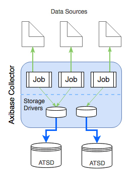
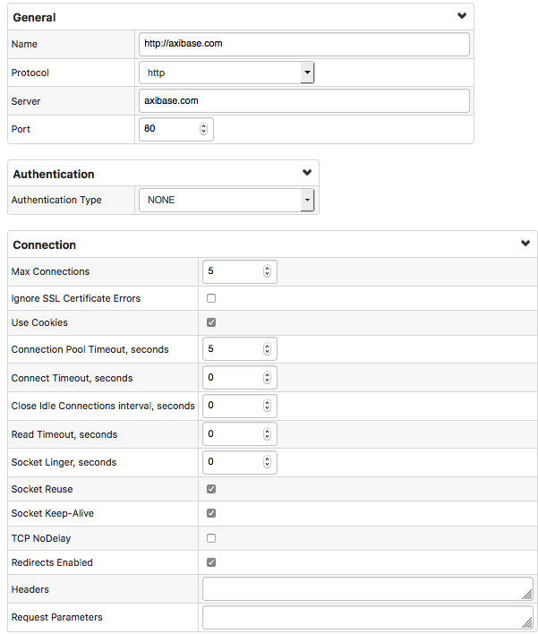

# Storage Driver Configuration

## Overview

Data retrieved by Axibase Collector from external data sources is persisted by Collector in one or multiple ATSD databases configured on the **Admin > Storage Drivers** page.

By default configuration, all jobs running in the Collector transmit data into the same ATSD instance using a single shared storage driver.

The storage driver sends data into ATSD over HTTP protocol.

With advanced configuration, each job stores data in a specific ATSD instance using multiple storage drivers.

## Requirements

To store data in a specific ATSD instance, Collector uses a restricted user account defined in the target ATSD instance and authorized to write data and metadata for all or specific entities.

Create a [collector account](https://axibase.com/docs/atsd/administration/collector-account.html) on the **Settings > User Accounts** page in the ATSD web interface.

## Initial Configuration

If a storage driver is not yet configured, the database prompts you to create one on initial login.

* Specify the hostname or IP address of the target ATSD server.
* Specify `https` service port address. The default is `8443`.
* Enter [collector account](https://axibase.com/docs/atsd/administration/collector-account.html) credentials.
* Click **Validate** to verify settings. In case of permission errors, ensure that the collector account has both `API_DATA_WRITE` and `API_META_WRITE` roles.
* If validation is successful, click **Save** to create the storage driver. Collector automatically creates an HTTP connection pool and a storage driver based on the submitted settings.

## Storage Driver

Storage drivers are enumerated on the **Admin > Storage Drivers** page.

To create a new storage driver, open the **Storage Drivers** page and click **Add**.

Choose an existing [HTTP connection pool](#http-pool) from the **HTTP Pool** drop-down list or create a new pool by clicking the plus icon.

Click **Test** to verify settings.

If Collector has multiple storage drivers defined, each job can be configured to send collected data into a specific ATSD instance.

## HTTP Pool

The Collector transmits data into ATSD via HTTP protocol. The HTTP connection pool settings contain various limits and timeouts applied to HTTP connections initiated by Collector when sending data into ATSD.

### Create a New Pool

* Open the **Data Sources > HTTP Pools** page in the top menu and click **Add**.
* Enter a pool name.
* Enter the hostname or IP address to the target ATSD server.
* Define port `8443` and select `https` protocol.
* Clear **Ignore SSL Certificate Errors** if the target ATSD [SSL certificate](https://axibase.com/docs/atsd/administration/ssl-ca-signed.html) is **trusted** (not self-signed).
* Set timeouts and limits based on the [recommended settings](#recommended-pool-settings) below.
* Select `Authentication Type=BASIC`, enter [collector account](https://axibase.com/docs/atsd/administration/collector-account.html) credentials.
* Set **Test Path** to `/ping`.
* Click **Test** to verify settings.

If the settings are valid, the test displays `200 OK` status.

In case of `4xx` status codes, refer to [ATSD Authentication Codes](https://axibase.com/docs/atsd/administration/user-authentication.html#authentication-and-authorization-errors) for troubleshooting.

Sample HTTP Pool used by storage driver:

### Recommended Pool Settings

**Setting** | **Value**
----- | -----
Max Connections | `16`
Use Cookies | `false`
Connection Pool Timeout | `15`
Connect Timeout | `15`
Close Idle Connections interval | `60`
Read Timeout | `15`
Socket Linger | `0`
Socket Reuse | `true`
Socket Keep-Alive | `true`
