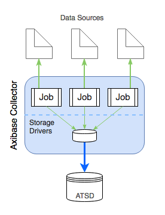
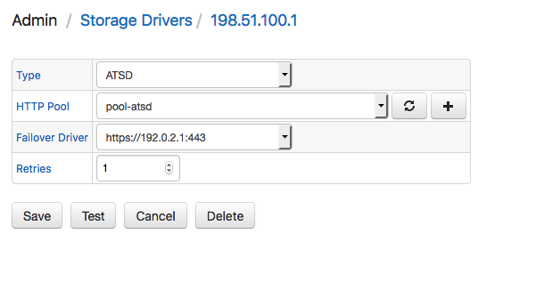

# Storage Driver Configuration

## Overview

Data retrieved by Axibase Collector from external data sources is persisted by Collector in one or multiple ATSD databases, configured at **Admin > Storage Drivers**.

By default, all jobs running in Collector transmit data into the same ATSD instance using a single shared storage driver.

The storage driver sends data into ATSD over HTTP protocol.

Via advanced configuration, each job can store data in a specific ATSD instance by using multiple storage drivers.

## Requirements

To store data in a specific ATSD instance, Collector uses a restricted user account defined in the target ATSD instance and authorized to write data and metadata for all or specific entities.

Create a [Collector account](https://axibase.com/docs/atsd/administration/collector-account.html) at **Settings > User Accounts** in the ATSD web interface.

## Initial Configuration

If no storage driver is configured for an ATSD instance, the database prompts you to create one upon login.

* Specify hostname or IP address of the target ATSD server.
* Specify `https` service port address, default port is `8443`.
* Enter [Collector account](https://axibase.com/docs/atsd/administration/collector-account.html) credentials.
* Click **Validate** to verify settings. In case of permission errors, ensure that specified Collector account has both `API_DATA_WRITE` and `API_META_WRITE` roles.
* Upon successful validation, click **Save** to create the storage driver. Collector automatically creates an HTTP connection pool and storage driver based on submitted settings.

## Storage Driver

Storage drivers are enumerated at **Admin > Storage Drivers**.

To create a new storage driver, navigate to the **Storage Drivers** page and click **Add**.

Choose an existing [HTTP connection pool](#http-pool) from the **HTTP Pool** drop-down list or create a new pool by clicking .

If necessary specify [Failover driver](#failover-driver).

Click **Test** to verify settings.

If Collector contains multiple storage drivers, each unique job can be configured to send collected data into a specific ATSD instance.

## HTTP Pool

The Collector transmits data into ATSD via HTTP protocol. HTTP connection pool settings contain limits and timeouts which apply to HTTP connections initiated by Collector when sending data into ATSD.

### Create a New Pool

* Navigate to **Data Sources > HTTP Pools** from the top menu and click **Add**.
* Enter a pool name.
* Enter hostname or IP address of the target ATSD server.
* Specify port `8443` and select `https` protocol.
* Clear **Ignore SSL Certificate Errors** if the target ATSD [SSL Certificate](https://axibase.com/docs/atsd/administration/ssl-ca-signed.html) is **trusted** (not self-signed).
* Set timeouts and limits based on the [recommended settings](#recommended-pool-settings) below.
* Select `Authentication Type=BASIC`, enter [Collector account](https://axibase.com/docs/atsd/administration/collector-account.html) credentials.
* Set **Test Path** to `/ping`.
* Click **Test** to verify settings.

If the settings are valid, the test returns `200 OK` status.

In case of `4xx` status codes, refer to [ATSD Authentication Codes](https://axibase.com/docs/atsd/administration/user-authentication.html#authentication-and-authorization-errors) for troubleshooting.

Sample HTTP Pool used by storage driver:

### Recommended Pool Settings

**Setting** | **Value**
----- | -----
Max Connections | `16`
Use Cookies | `false`
Connection Pool Timeout | `15`
Connect Timeout | `15`
Close Idle Connections interval | `60`
Read Timeout | `15`
Socket Linger | `0`
Socket Reuse | `true`
Socket Keep-Alive | `true`

## Failover driver

Collector supports failover mechanism, if a storage driver is not available in some moment collector automatically switches  to  failover driver
and tries to send data to another ATSD instance. If main driver becomes available, collector switches back to the storage driver.

