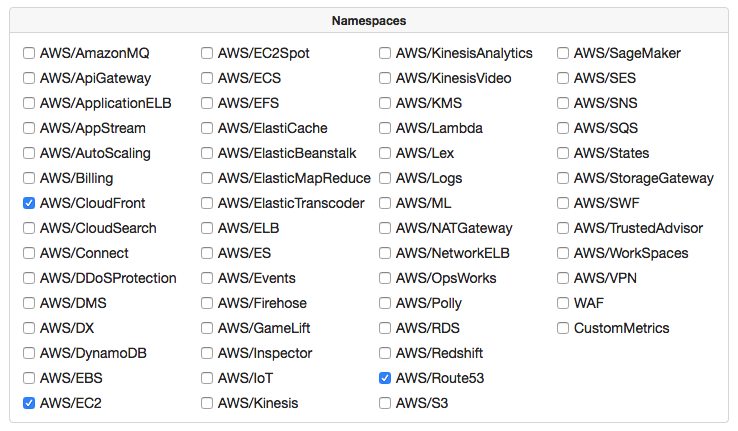
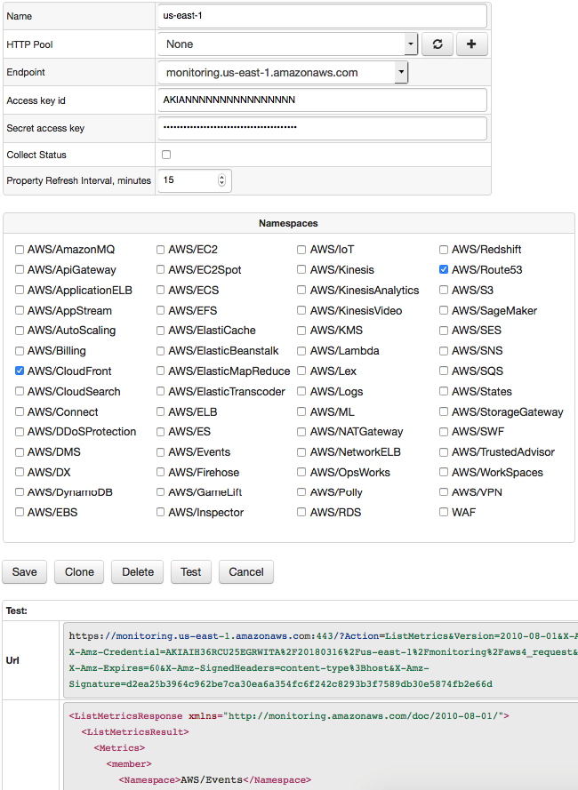
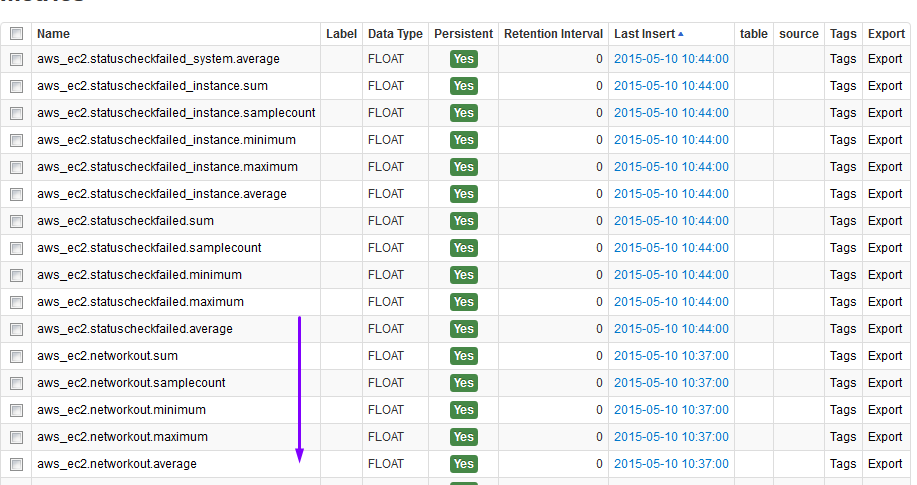
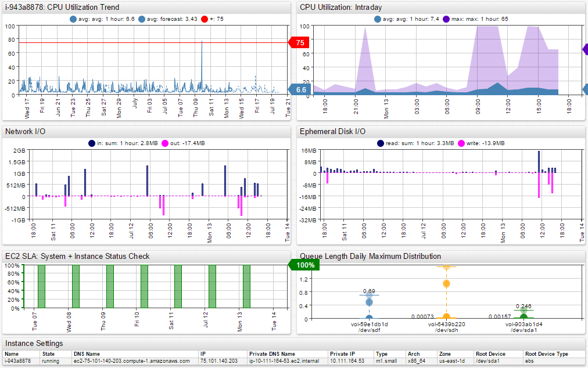
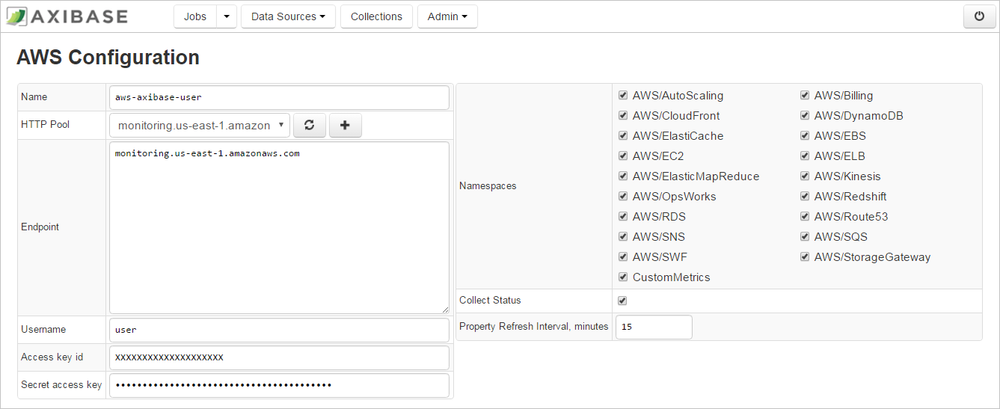

# AWS Job

## Overview

AWS Job copies [AWS CloudWatch](https://aws.amazon.com/cloudwatch/) statistics into ATSD for long-term retention, reporting, and visualization.

This job maintains markers for each CloudWatch metric in the built-in Collector database to load only incremental data. These markers allow the job to execute optimized API requests and avoid data gaps in case of network outages.

When started for the first time, the AWS Job loads available historical data for up to two weeks.

Configure each AWS Job to retrieve metrics from different [AWS regions](https://docs.aws.amazon.com/general/latest/gr/rande.html#cw_region).

## Supported Namespaces

Each AWS [namespace](https://docs.aws.amazon.com/AmazonCloudWatch/latest/DeveloperGuide/aws-namespaces.html) provides a set of metrics available for resources of a particular type.

Refer to [AWS Documentation](https://docs.aws.amazon.com/AmazonCloudWatch/latest/DeveloperGuide/CW_Support_For_AWS.html) for a complete list of available metrics.

Configure an AWS Job to collect metrics for all or a subset of namespaces. To reduce the number of API queries, collect data only for AWS services that you use.

**Available namespaces**:



## Schema

CloudWatch metrics are stored in ATSD using the following naming convention:

```ls
{namespace}.{metric-name}.{statistic-name}
```

The composite metric name is normalized by replacing slash and whitespace symbols with underscores.

```ls
aws_ebs.volumeidletime.maximum
```

For each metric, AWS Job retrieves the following period statistics:

* `average`
* `minimum`
* `maximum`
* `sum`
* `sample count`

The AWS statistics are stored by ATSD as metrics. This enables the database to compute aggregate statistics on top of AWS statistics.

For example, the **AWS/Billing Estimated Charges** metric is stored as 5 metrics:

* `aws_billing.estimatedcharges.minimum`
* `aws_billing.estimatedcharges.maximum`
* `aws_billing.estimatedcharges.sum`
* `aws_billing.estimatedcharges.average`
* `aws_billing.estimatedcharges.samplecount`

The number of metrics within each namespace varies greatly. For AWS/EC2 the list consists of more than 15 [metrics](#sample-aws-ec2-cloudwatch-metrics).

The job assigns each metric to an entity which is extracted from the [primary dimension](#namespace-dimensions).

## Configuration Settings

| **Field** | **Description** |
|:---|:---|
| `Name` | Configuration name. |
| `HTTP Pool` | Pool of HTTPS connections to execute requests against the specified CloudWatch endpoint. The pool can be left empty. See [HTTP Pool](./http-pool.md) for more information. |
| `Endpoint`  | [CloudWatch Endpoint](https://docs.aws.amazon.com/general/latest/gr/rande.html#cw_region) URL.   |
| `Access key id`  | Access key. See [Getting Your Access Key ID and Secret Access Key](https://docs.aws.amazon.com/AWSSimpleQueueService/latest/SQSGettingStartedGuide/AWSCredentials.html).   |
| `Secret access key`  | Secret access key. |
| `Namespaces`  | CloudWatch metric namespaces enabled for collection.   |
| `Collect Status`  |  Collect status check metrics such as <br/>`StatusCheckFailed`, `StatusCheckFailed_Instance`, `StatusCheckFailed_System` |
| `Property Refresh` <br/> Interval, minutes | Interval at which to load resource attributes. |

## Configuration Steps

* Create a read-only [IAM account](./aws-iam.md) to query CloudWatch statistics.
* Open the **Jobs** page, click **Add Job**, and select **Use Wizard**.
* Specify access and secret keys.
* Select AWS regions from which to collect data. <br/>The wizard creates a separate AWS configuration for each region within the same job.
* Validate the credentials and save the job if there are no errors.


* Select one of the configurations and click **Test**.



* To view available metrics for a particular namespace, clear the checkboxes for all namespaces except one and click **Test**.

## Validation

* Open the AWS job page and set the schedule to `R 0/5 * * * ?` to execute the job every five minutes with random seconds.
* On the **AWS Jobs** page, check that `Items Read` and `Commands Sent` are greater than `0`.
* Log in to ATSD. Open the **Metrics** tab and review available metrics by typing `aws` into the **Name Mask**.<br/>Note that the AWS job takes some time to load backlogged historical data for all metrics after creation.
* Open the **Entities** tab and locate one of AWS EC2 instances. Click the **Portal** links to access pre-defined AWS portals.



## Sample Dashboards

* [EC2](https://apps.axibase.com/chartlab/0aa34311)



* [EBS](https://apps.axibase.com/chartlab/e8977b4a)


## Configuration Example



## Sample AWS EC2 CloudWatch Metrics

* `aws_ec2.cpucreditbalance`
* `aws_ec2.cpucreditusage`
* `aws_ec2.cpuutilization`
* `aws_ec2.diskreadbytes`
* `aws_ec2.diskreadops`
* `aws_ec2.diskwritebytes`
* `aws_ec2.diskwriteops`
* `aws_ec2.networkin`
* `aws_ec2.networkout`
* `aws_ec2.networkpacketsin`
* `aws_ec2.networkpacketsout`
* `aws_ec2.statuscheckfailed`
* `aws_ec2.statuscheckfailed_instance`
* `aws_ec2.statuscheckfailed_system`

## AWS CloudWatch API Fees

AWS applies [usage charges](https://aws.amazon.com/cloudwatch/pricing/) for CloudWatch API requests with free entitlement available on a monthly basis.

An extra fee is charged for detailed monitoring, as well as for custom metrics. The detailed monitoring provides `1-minute` period granularity and a lower delay, typically one or two minutes, whereas the basic monitoring can have a delay between five and ten minutes.

## Namespace Dimensions

The primary dimension determines entity name in ATSD.

|**Namespace**|**Primary Dimension**|
|---|---|
| `AWS/Route53` | `HealthCheckId` |
| `AWS/ApiGateway` | `ApiName` |
| `AWS/AppStream` | `Fleet` |
| `AWS/AutoScaling` | `AutoScalingGroupName` |
| `AWS/Billing` | `ServiceName` |
| `AWS//CloudFront` | `DistributionId` |
| `AWS/CloudSearch` | `ClientId` |
| `CWAgent` | `InstanceId` |
| `AWS/Events` | `RuleName` |
| `AWS/Logs` | `LogGroupName` |
| `AWS/Connect` | `InstanceId` |
| `AWS/DMS` --> extract `id` or `arn` |
| `AWS/DX` | `ConnectionId` |
| `AWS/DynamoDB` | `TableName` |
| `AWS/EC2` | `InstanceId` |
| `AWS/EC2Spot` | `AvailabilityZone` |
| `AWS/ECS` | `ClusterName` |
| `AWS/ElasticBeanstalk` | `InstanceId` |
| `AWS/EBS` | `VolumeId` |
| `AWS/EFS`| `FileSystemId` |
| `AWS/ELB` | `LoadBalancerName`  |
| `AWS/ApplicationELB` | `LoadBalancerName` |
| `AWS/NetworkELB` | `LoadBalancer` |
| `AWS/ElasticTranscoder` | `PipelineId` |
| `AWS/ElastiCache` | `CacheClusterId` |
| `AWS/ES` | `ClientId` |
| `AWS/ElasticMapReduce` | `JobId` |
| `AWS/GameLift` | `FleetId` |
| `AWS/Inspector` | ??? |
| `AWS/IoT` | `RuleName` |
| `AWS/KMS` | `KeyId` |
| `AWS/KinesisAnalytics` | `Flow` |
| `AWS/Firehose` | `DeliveryStreamName` |
| `AWS/Kinesis` | `StreamName` |
| `AWS/KinesisVideo` | `StreamName` |
| `AWS/Lambda` | `FunctionName` |
| `AWS/Lex` | `BotName` |
| `AWS/ML` | `MLModelId` |
| `AWS/OpsWorks` | `InstanceId` |
| `AWS/Polly` | `Operation` |
| `AWS/Redshift` | `NodeID` |
| `AWS/RDS` | `DBInstanceIdentifier` |
| `AWS/Route53` | `HealthCheckId` |
| `AWS/SageMaker` | `Host` |
| `AWS/DDoSProtection` |  |
| `AWS/SES` | |
| `AWS/SNS` | Application |
| `AWS/SQS` | `QueueName` |
| `AWS/S3` | `BucketName` |
| `AWS/SWF` | Domain |
| `AWS/States` | `*arn` |
| `AWS/StorageGateway` | `GatewayName` |
| `AWS/NATGateway` | `NatGatewayId` |
| `AWS/VPN` | `VpnId` |
| `WAF` | Rule |
| `AWS/WorkSpaces` | `WorkspaceId` |
| `AWS/AmazonMQ` | Topic  |
| `AWS/TrustedAdvisor` | `ServiceName` |