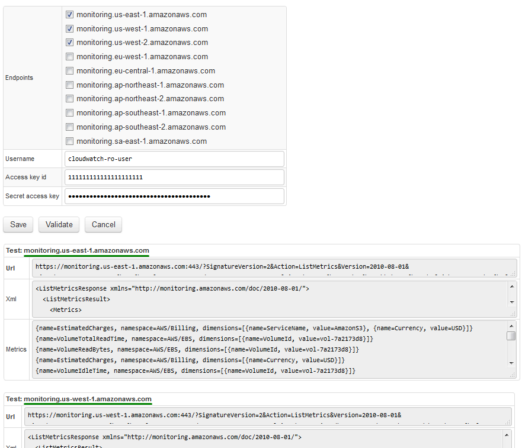
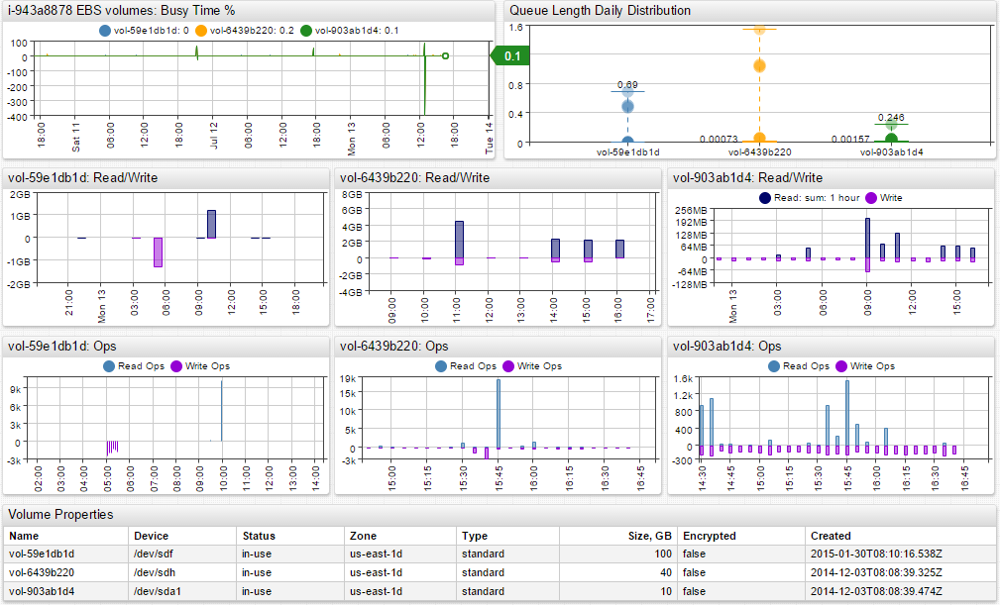

# AWS Job

## Overview

AWS job allows you to collect data from the [Amazon Web Services CloudWatch](https://aws.amazon.com/cloudwatch/) service and store it in the Axibase Time Series Database for long-term retention, reporting, and analytics.

Refer to [AWS documentation](http://docs.aws.amazon.com/AmazonCloudWatch/latest/DeveloperGuide/CW_Support_For_AWS.html) for a complete list of available metrics.

The request is submitted to the specified endpoint using the GET method with `application/x-www-form-urlencoded` content type. The request includes additional AWS parameters (Version, X-Amz-Date) and is signed with [AWS Signature Version 4](http://docs.aws.amazon.com/general/latest/gr/signature-version-4.html).

The AWS job includes multiple configurations to query metrics from different [regional endpoints](http://docs.aws.amazon.com/general/latest/gr/rande.html#cw_region). The endpoints are queried sequentially within each job invocation.

The job stores markers for each metric so that API requests are incremental and load only the most recent data. These markers allow the job to build optimized queries and to avoid data gaps in case of service outages.

When an AWS job is started for the first time, it will load and configure all of the available current historical data from the CloudWatch service (up to the previous 2 weeks).

## AWS CloudWatch API Fees

AWS applies [usage charges](https://aws.amazon.com/cloudwatch/pricing/) for CloudWatch API requests with free entitlement available on a monthly basis.  

An extra fee is charged for detailed monitoring, as well as for custom metrics. The detailed monitoring provides 1-minute period granularity and a lower delay, typically 1 or 2 minutes, whereas basic monitoring can have a delay between 5 and 10 minutes.

## Supported Namespaces

AWS Namespace is a group of metrics exposed for a particular AWS service type.

Each configuration can be set to collect metrics from multiple namespaces available in the region.

To minimize the number of API queries, choose to collect data only for AWS services that you're actually using. 

For more information, see [AWS Namespaces](http://docs.aws.amazon.com/AmazonCloudWatch/latest/DeveloperGuide/aws-namespaces.html).

* AWS/AutoScaling 
* AWS/Billing 
* AWS/CloudFront
* AWS/CloudSearch 
* AWS/Events 
* AWS/Logs
* AWS/DynamoDB 
* AWS/ECS 
* AWS/ElastiCache
* AWS/EBS 
* AWS/EC2 
* AWS/EC2Spot
* AWS/ELB 
* AWS/ElasticMapReduce 
* AWS/ES
* AWS/Kinesis 
* AWS/Firehose 
* AWS/Lambda
* AWS/ML 
* AWS/OpsWorks 
* AWS/Redshift
* AWS/RDS 
* AWS/Route53 
* AWS/SNS
* AWS/SQS 
* AWS/S3 
* AWS/SWF
* AWS/StorageGateway 
* AWS/WAF 
* AWS/WorkSpaces
* CustomMetrics

The underlying metrics in each namespace are stored in ATSD using the following naming convention:

```css
{namespace}.{metric-name}.{statistic-name}
```

The composite metric name is normalized by replacing slash and whitespace symbols with underscores.

For example, the `AWS/Billing Estimated Charges` metric is stored as 5 metrics:

* `aws_billing.estimatedcharges.minimum`
* `aws_billing.estimatedcharges.maximum`
* `aws_billing.estimatedcharges.sum`
* `aws_billing.estimatedcharges.average`
* `aws_billing.estimatedcharges.samplecount`

ATSD treats avg, min, max, and sum statistics received from AWS as raw data, which means that ATSD can compute aggregate statistics on top of AWS statistics.

The number of metrics within each namespace varies greatly. For AWS/EC2 the list consists of 15+ [metrics](#aws-ec2-metrics).

You can configure the AWS job to collect metrics for all or a subset of namespaces. For each metric, the AWS job retrieves the following period statistics: average, minimum, maximum, sum, sample count. The length of the period is typically 5 minutes, although a 1 minute period is available if detailed monitoring is enabled. 

## Configuration Settings

| **Field** | **Description** |
|:---|:---|
| Name | Configuration name. |
| HTTP Pool | Pool of http(s) connections to execute CloudWatch API requests against the specified CloudWatch endpoint. |
| Endpoint  | [CloudWatch Endpoint](http://docs.aws.amazon.com/general/latest/gr/rande.html#cw_region) URL.   |
| Username  |  Username to query AWS Cloudwatch API. <br>Refer to this [note](aws-iam.md) on how to create a read-only account. |
| Access key id  | Access key. See [Getting Your Access Key ID and Secret Access Key](http://docs.aws.amazon.com/AWSSimpleQueueService/latest/SQSGettingStartedGuide/AWSCredentials.html).   |
| Secret access key  | Secret access key. |
| Namespaces  | CloudWatch metric namespaces enabled for collection.   |
| Collect Status  |  Collect status check metrics such as <br>`StatusCheckFailed`, `StatusCheckFailed_Instance`, `StatusCheckFailed_System` |
| Property Refresh <br> Interval, minutes | Interval for refreshing resource properties. |

## Configuration Steps

* Create a read-only [IAM account](aws-iam.md) for querying CloudWatch statistics.
* Open the **Jobs:Add Job:Use Wizard** page.
* Enter IAM account credentials.
* Select AWS regions from which you want to collect data. <br>The wizard will create a separate AWS configuration for each region within the same job.
* Validate the credentials and save the job if there are no errors.



## Validation

* Open the AWS job page and set the schedule to `R 0/5 * * * ?` to execute the job every 5 minutes with random seconds.
* On the AWS Jobs list page, check that Items Read and Commands Sent are greater than 0.
* Login into ATSD. Open the **Metrics** tab and review available metrics by typing `aws` into the Name Mask.<br>Note that it may take the AWS job a while to load backlogged historical data for all metrics after the job was created.
* Open the Entities tab and locate one of AWS EC2 instances. Click on Portal links to access pre-defined AWS portals.


## Sample Dashboards

* [EC2](https://apps.axibase.com/chartlab/0aa34311)


* [EBS](https://apps.axibase.com/chartlab/e8977b4a)



## Configuration Example


## AWS/EC2 metrics

* aws_ec2.cpucreditbalance
* aws_ec2.cpucreditusage
* aws_ec2.cpuutilization
* aws_ec2.diskreadbytes
* aws_ec2.diskreadops
* aws_ec2.diskwritebytes
* aws_ec2.diskwriteops
* aws_ec2.networkin
* aws_ec2.networkout
* aws_ec2.networkpacketsin
* aws_ec2.networkpacketsout
* aws_ec2.statuscheckfailed
* aws_ec2.statuscheckfailed_instance
* aws_ec2.statuscheckfailed_system
