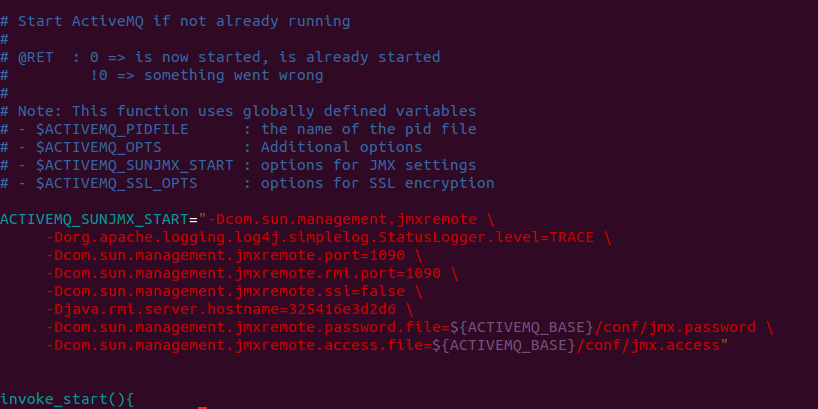
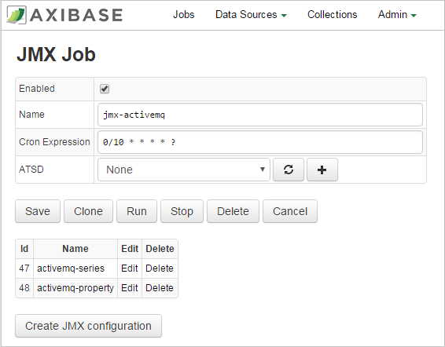
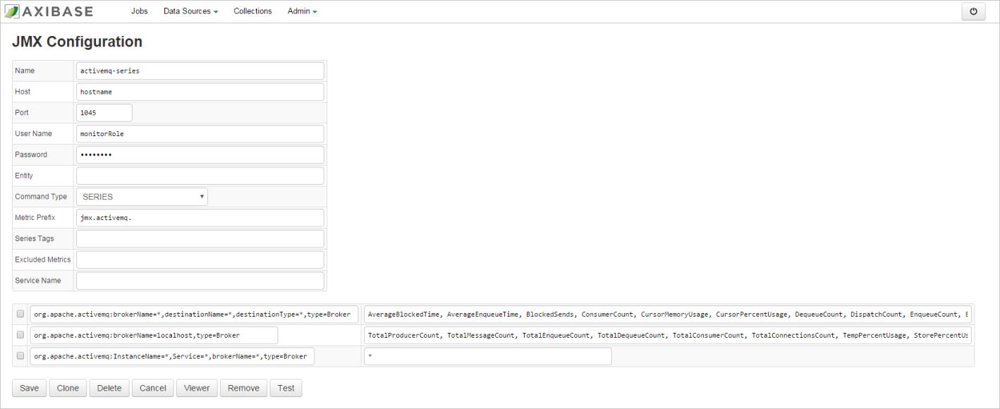
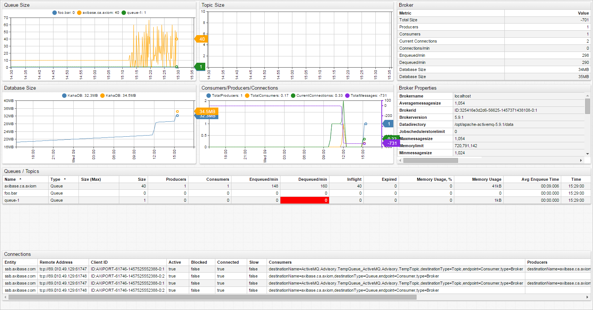

# Monitoring ActiveMQ with ATSD

## Overview

This document describes the process of configuring ActiveMQ for availability and performance monitoring with the Axibase Time Series Database.

## Requirements

* [ActiveMQ version 5.x.+](http://activemq.apache.org)

## Installation Steps

### Configure ActiveMQ Server

#### Enable JMX and Log Aggregator

* Log in to the ActiveMQ server via SSH.
* Change to the ActiveMQ installation directory.

```sh
cd /opt/apache-activemq-5.13.1
```

* Download the log aggregation filter `.jar` files to the ActiveMQ lib directory:

```sh
wget --content-disposition -P ./lib/ \
   "https://repository.sonatype.org/service/local/artifact/maven/redirect?r=central-proxy&g=com.axibase&a=aggregation-log-filter&v=LATEST"
wget --content-disposition -P ./lib/ \
   "https://repository.sonatype.org/service/local/artifact/maven/redirect?r=central-proxy&g=com.axibase&a=aggregation-log-filter-log4j&v=LATEST"
```

* Append aggregation filter settings to the ActiveMQ `log4j.properties` file. Replace `atsd_hostname` with the hostname of the ATSD server:

```sh
cat <<EOF >> ./conf/log4j.properties
log4j.appender.logfile.filter.COLLECTOR=com.axibase.tsd.collector.log4j.Log4jCollector
log4j.appender.logfile.filter.COLLECTOR.writerHost=atsd_hostname
EOF
```

See [Aggregation Log Filter](https://github.com/axibase/aggregation-log-filter) for additional configuration options.

* Modify JMX settings in ActiveMQ JVM launch options.
  * Search for the `ACTIVEMQ_SUNJMX_START` setting and modify the setting as specified below.
  * Replace `activemq_hostname` with the full hostname or the IP address of the ActiveMQ server.
  * This must be the same hostname that Axibase Collector uses when connecting to the ActiveMQ server.
  * For more information on configuring JMX in ActiveMQ, see [Apache ActiveMQ Documentation](http://activemq.apache.org/jmx.html)

ActiveMQ `5.11.x` and later:

```sh
vi ./bin/env
```

```sh
ACTIVEMQ_SUNJMX_START="$ACTIVEMQ_SUNJMX_START -Dcom.sun.management.jmxremote"
ACTIVEMQ_SUNJMX_START="$ACTIVEMQ_SUNJMX_START -Dcom.sun.management.jmxremote.port=1090"
ACTIVEMQ_SUNJMX_START="$ACTIVEMQ_SUNJMX_START -Dcom.sun.management.jmxremote.rmi.port=1090"
ACTIVEMQ_SUNJMX_START="$ACTIVEMQ_SUNJMX_START -Dcom.sun.management.jmxremote.ssl=false"
ACTIVEMQ_SUNJMX_START="$ACTIVEMQ_SUNJMX_START -Djava.rmi.server.hostname=activemq_hostname"
ACTIVEMQ_SUNJMX_START="$ACTIVEMQ_SUNJMX_START -Dcom.sun.management.jmxremote.password.file=${ACTIVEMQ_CONF}/jmx.password"
ACTIVEMQ_SUNJMX_START="$ACTIVEMQ_SUNJMX_START -Dcom.sun.management.jmxremote.access.file=${ACTIVEMQ_CONF}/jmx.access"
```

ActiveMQ `5.10.x` and earlier:

```sh
vi ./bin/activemq
```

```sh
ACTIVEMQ_SUNJMX_START="-Dcom.sun.management.jmxremote \
   -Dcom.sun.management.jmxremote.port=1090 \
   -Dcom.sun.management.jmxremote.rmi.port=1090 \
   -Dcom.sun.management.jmxremote.ssl=false \
   -Djava.rmi.server.hostname=activemq_hostname \
   -Dcom.sun.management.jmxremote.password.file=${ACTIVEMQ_BASE}/conf/jmx.password \
   -Dcom.sun.management.jmxremote.access.file=${ACTIVEMQ_BASE}/conf/jmx.access"
```

The expected result is:



* Modify JMX security credential files in the `./conf` directory.

<!-- markdownlint-disable MD106-->
jmx.access:

```sh
# The "monitorRole" role has readonly access.
monitorRole readonly
```

jmx.password:
<!-- markdownlint-enable MD106-->

```sh
# The "monitorRole" role has password "abc123".
monitorRole abc123
```

* Secure access to the `jmx.password` file by restricting permissions:

```sh
chmod 600 ./conf/jmx.password
```

* Restart ActiveMQ server.

```sh
./bin/activemq stop
./bin/activemq start
```

#### Configure ActiveMQ JMX Job

1. Log in to Axibase Collector at `https://collector_hostname:9443`.
1. Click the **Jobs** tab in the top menu.
1. Locate the `jmx-activemq` job.
1. On the **JMX Job** page, enable job status by checking the box and selecting **Enabled** from the split-button at the bottom of the screen.
1. Adjust the `cron` expression if required. By default, the job is executed every 10 seconds.

> For more information on `cron` expressions, see [Scheduling](../../../scheduling.md).



##### Configuring activemq-series

1. Select the `activemq-series` configuration.
1. On the **JMX Configuration** page, enter the JMX connection parameters as above:

* **Host** — ActiveMQ hostname. Must be the same as the `activemq_hostname`.
* **Port** — JMX port.
* **User Name** — JMX user name such as `monitorRole`. Read-only permissions are sufficient.
* **Password** — Password for JMX user.
* **Entity** — Optionally, specify the output of the hostname command on the ActiveMQ server if hostname is different from `activemq_hostname` (for example if `activemq_hostname` represents a fully qualified name).
  Other parameters are optional. For more information on JMX configuration, see [JMX](../../../jobs/jmx.md).

* **Host** — ActiveMQ hostname. Must be the same as the `activemq_hostname`.
* **Port** — JMX port.
* **User Name** — JMX user name such as `monitorRole`. Read-only permissions are sufficient.
* **Password** — Password for JMX user.
* **Entity** — Optionally, specify the output of the hostname command on the ActiveMQ server if the hostname is different from `activemq_hostname` (for example if `activemq_hostname` represents a fully qualified name).

Other parameters are optional. For more information on JMX configuration, see [JMX](../../../jobs/jmx.md).

1. Click Test to validate the configuration.

If the specified configuration is correct, there must be no errors or empty fields in the test results.

1. Click **Save**.



##### Configuring activemq-property

1. From the table on the **JMX Job** page, click **Edit** next to the `activemq-property` configuration.
1. Set **Host**, **Port**, **User Name**, **Password**, and **Entity** fields as described in the previous section.
1. Click **Test** to validate the configuration.
1. Click **Save**.


## Viewing Data in ATSD

### Metrics

* List of collected [ActiveMQ metrics](./metric-list.md)

### Properties

* List of collected [Active MQ properties](./properties-list.md)

### Entity group

* Open **Settings > Entity Groups**, select **Import** from the split-button and upload  [activemq_entity_group.xml](./configs/activemq_entity_group.xml).
* Select the imported `apache-activemq-brokers` group.
* Verify that the group contains your Active MQ hosts.

### Entity Views

* Open **Entity Views > Configure**, select **Import** from the split-button and upload  [activemq_entity_view.xml](./configs/activemq_entity_view.xml).
* Select the imported `Apache ActiveMQ Brokers` view.
* Select the Entity Group that you created earlier.
* Click **View** and browse information about your entities.


### Portal

* Open the **Portals** menu and select **Configure**. Select **Import** from the split-button and upload [activemq_portal.xml](./configs/activemq_portal.xml).
* Click the **Assign** link and associate the portal with the entity group you created earlier.
* Open the **Entities** tab, find the java application by name, and click the **Portal** icon.


[**Active MQ Live Portal**](https://apps.axibase.com/chartlab/2f11a5ef)


### Rules

### Setting up **Mail Client**

* Configure [Mail Client](https://axibase.com/docs/atsd/administration/mail-client.html).

#### Import Rules

* Open the **Configuration > Rules** page, click **Import** and upload [`jvm_rules.xml`](./configs/activemq_rules.xml).
* For each created rule, open the rule in the **Rule Editor**, and change the recipient address on the **Email Notifications** tab.
* These rules automatically apply to all JVM-based applications monitored by Axibase Collector.

Imported rules:

| **Rule** |  **Description** |
| :--- | :--- |
| activemq_broker_configuration_change | Send a notification on configuration change. |
| activemq_connection_count | Raise an alert when connection count exceeds the specified threshold. |
| activemq_enqueue_stopped |  Raise an alert when enqueueing stops (no new messages are received). |
| activemq_health_status |   Raise an alert when Activemq health status is abnormal. |
| activemq_unauthorized_connection | Raise an alert when connection from unauthorized IP address is detected. |

To create your own rules, refer to [Rule Engine documentation](https://axibase.com/docs/atsd/rule-engine/).