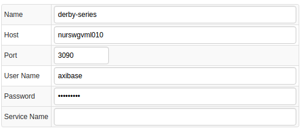

# Derby Database

## Overview

This document describes how to collect JMX metrics exposed by the [Apache Derby Database](https://db.apache.org/derby/) for long-term retention and monitoring with [Axibase Time Series Database](https://axibase.com/docs/atsd/).

## Requirements

* Derby database `9+`

## Installation Procedure

### Enable JMX in Java application

Configure Java applications for JMX monitoring according to [JMX Job Documentation](../../jmx.md).

### Import Derby Job into Axibase Collector

* On the **Jobs** page, click **Import** and upload the [derby-job.xml](./configs/derby_job.xml) file.

### Configure Derby JMX Connection

* Open the **Jobs** menu and click **JMX**, then select the `jmx-derby` job.
* For each JMX Configuration:
  * Provide connection parameters to the target Derby as displayed below:

  

  * Click **Test** and ensure that the result is similar to the screenshot:

  

### Schedule the Job

* Open the **JMX Job** page and click **Run**.
* Ensure that the job status is `COMPLETED` and `Items Read` and `Sent commands` are greater than `0`.

* If there are no errors, set job status to **Enabled** and save the job.

### Verify Metrics in ATSD

* Log in to ATSD.
* Open **Metrics** tab and filter metrics by name `jmx.derby*`.

## Viewing Data in ATSD

### Metrics

* List of collected [Derby metrics](./metric-list.md)

### Properties

* List of collected [Derby properties](./properties-list.md)

### Entity group

* Open **Settings** menu and click **Entity Groups**, click **Import**, and upload  [derby_entity_group.xml](./configs/derby_entity_group.xml).
* Select the imported `apache-derby-databases` group.
* Verify that the group contains your Derby hosts.

### Entity Views

* Open **Entity Views** page, click **Import** and upload  [derby_entity_view.xml](./configs/derby_entity_view.xml)
* Select the imported `Apache Derby Databases` view.
* Select the Entity Group that you created earlier.
* Click **View** and browse information about existing entities:

### Portal

* Open the **Portals** page from the menu along the top of the interface, click **Import** from the split button, and upload [derby_portal.xml](./configs/derby_portal.xml).
* Click the **Assign** link and associate the portal with the entity group created earlier.
* Open **Entity** tabs, find the java application by name, and click the **Portal** icon.

[**Derby Live Portal**](http://apps.axibase.com/chartlab/c4412a78)

