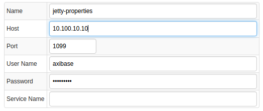

# Jetty Web Server

## Overview

This document describes how to collect JMX metrics exposed by [Jetty (Web server)](http://www.eclipse.org/jetty/) for long-term retention and monitoring in Axibase Time Series Database.

## Requirements

* Jetty `6.+`

## Installation Steps

### Enable JMX in Java Application

Configure your Java application for JMX monitoring as described by the [JMX Job Documentation](../../jmx.md).

### Import Jetty job into Axibase Collector

* Open the **Jobs** menu and click **Import**. Upload the [jetty-job.xml](configs/jetty_job.xml) file.

### Configure Jetty JMX Connection

* Open the **Jobs** menu and select **JMX**. Open the `jmx-jetty` job.
* For each JMX Configuration:
* Provide connection parameters to the target Jetty:

* Click the **Test** button and make sure that the result is correct:

### Schedule the Job

* Open the `JMX Job` page and click the **Run** button for the Jetty JMX job.
* Make sure that the job status is `COMPLETED` and **Items Read** and **Sent commands** are greater than 0.

* If there are no errors, set job status to **Enabled** and save the job.

### Verify Metrics in ATSD

* Log in to ATSD.
* Click the **Metrics** tab and filter metrics by name `jmx.jetty*`.

## Viewing Data in ATSD

### Metrics

* List of collected [Jetty metrics](metric-list.md).

### Properties

* List of collected [Jetty properties](properties-list.md).

### Entity Group

* Open **Admin** menu and select **Entity Groups**, click the **Import** button, and upload  [jetty_entity_group.xml](configs/jetty_entity_group.xml).
* Select the imported `jetty-web-server` group.
* Verify that the group contains your Jetty hosts.

### Entity Views

* Open **Entity Views** menu and select **Configuration**, click the **Import** button, and upload  [jetty_entity_view.xml](configs/jetty_entity_view.xml).
* Select the imported `Java Applications` view.
* Select the Entity Group that you created earlier.
* Click the **View** button and browse information about your entities.

### Portal

* Open the **Portals** and select **Configure**, click the **Import** button, and upload [jetty_portal.xml](configs/jetty_portal.xml).
* Click the **Assign** link and associate the portal with the entity group you created earlier.
* Open **Entities** tabs, find the java application by name, and click on the portal icon.

[**Jetty Live Portal**](http://apps.axibase.com/chartlab/4bcd2299)

