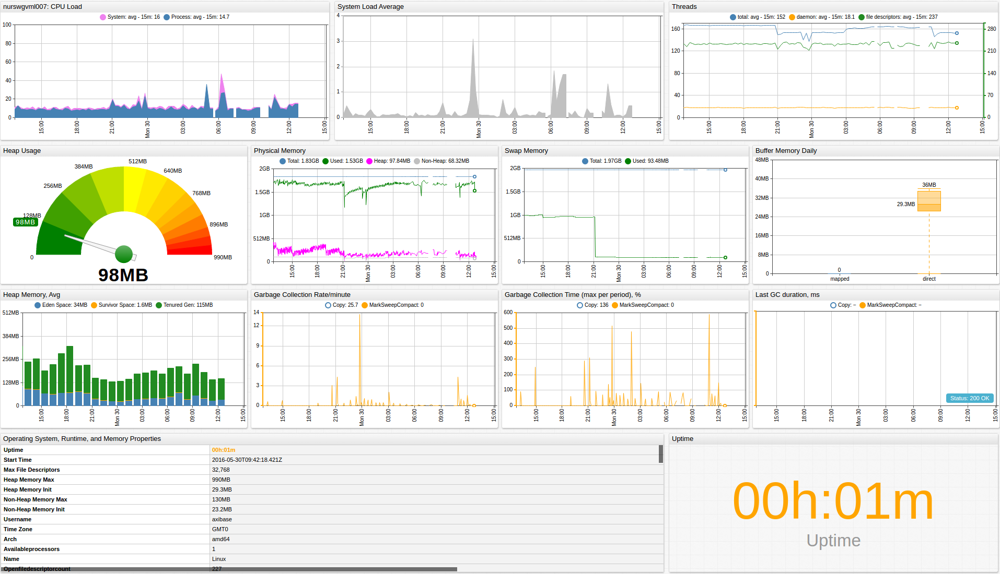

# Java Virtual Machine

## Overview

This document describes how to collect JMX metrics exposed by Java applications for long-term retention and monitoring in Axibase Time Series Database.

This integration enables both performance monitoring (garbage collection, load, threads, heap/offheap memory), availability monitoring (system uptime counter), as well as configuration tracking by notifying of any changes in the system properties.

## Requirements

* JRE/JDK `6+`

## Installation Steps

### Enable JMX in Java Application

Configure your Java application for JMX data collection as described by the [JMX Job Documentation](../../jmx.md).

### Import JVM Job into Axibase Collector

* On the **Jobs** page, select **Import** from the split button at the bottom of the page and upload the [jmx-jvm-job.xml](./configs/jvm_job.xml) file.

### Configure JMV JMX Connection

* Open the **Jobs** menu and select **JMX**. Click the `jmx-jvm` job.
* For each JMX Configuration:
* Provide connection parameters to the target JVM:

* Click **Test**:

### Schedule the Job

* Open the **JMX Job** page and click **Run** for the JVM JMX job.
* Ensure that the job status is `COMPLETED` and **Items Read** and **Sent commands** are greater than 0.

* If there are no errors, set the job status to **Enabled** and save.

### Verify Metrics in ATSD

* Log in to ATSD.
* Open **Metrics** tab and filter metrics by name `jmx.jvm*`.

## Viewing Data in ATSD

### Metrics

* List of collected [JVM metrics](./metric-list.md).

### Properties

* List of collected [JVM properties](./properties-list.md).

### Entity group

* Open **Settings** menu and click **Entity Groups**, select **Import** from the split button, and upload  [`jvm_entity_group.xml`](./configs/jvm_entity_group.xml).
* Select the imported `java-virtual-machine` group.
* Verify that the group contains your JVM hosts.

### Entity Views

* Open the **Entity Views** menu and select **Configuration**, click **Import**, and upload  [`jvm_entity_view.xml`](./configs/jvm_entity_view.xml).
* Select the imported `Java Applications` view.
* Select the Entity Group that you created earlier.
* Click **View** and browse information about your entities:

### Portal

* Open the **Portals** menu and select **Configure**, click **Import**, and upload [`jvm_portal.xml`](./configs/jvm_portal.xml).
* Click the **Assign** link and associate the portal with the entity group you created earlier.
* Open the Entity tab, find the java application by name, and click the **Portal** icon:

[**JVM Live Portal**](http://apps.axibase.com/chartlab/e6911d9d)

### Rules

### Setting up Mail Client

* Configure [Mail Client](https://axibase.com/docs/atsd/administration/mail-client.html).

#### Import Rules

* Open the **Alerts** menu and select **Rules**, click **Import**, and upload [`jvm_rules.xml`](./configs/jvm_rules.xml).
* For each created rule: open the rule in the **Rule Editor** and change recipient address on the **Email Notifications** tab.
* These rules automatically apply to all JVM-based applications monitored by Axibase Collector.

Imported rules:

| **Rule** |  **Description** |
| :--- | :--- |
| jvm_application_restart | Raise an alert when an application has been restarted less than 5 minutes ago.  |
| jvm_cpu_load | Raise an alert when an application cpu load exceeds the set threshold. |
| jvm_garbage_collection_rate |  Raise an alert when an application Garbage Collector rate exceeds the set threshold. |
| jvm_garbage_collection_time |   Raise an alert when an application Garbage Collector time exceeds the set threshold. |
| jvm_heap_memory_usage | Raise an alert when an application heap memory usage exceeds the set threshold. |
| jvm_runtime_property_changed | Raise an alert when an application property is changed. |
| jvm_system_load | Raise an alert when an application system load exceeds the set threshold. |

To create your own rules, refer to [Rule Engine documentation](https://axibase.com/docs/atsd/rule-engine/).
