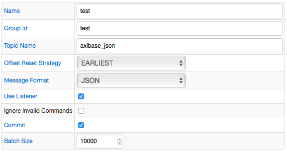
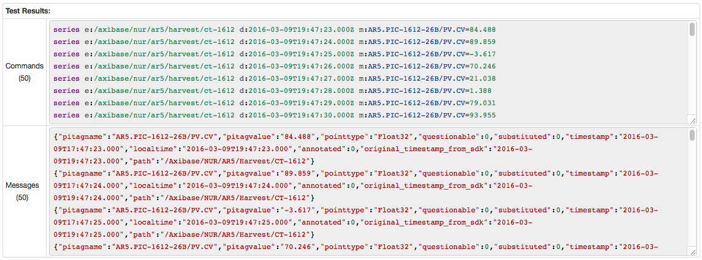

# Kafka Job Example: JSON format

## Kafka Message

```json
{
  "pitagname":"AXI.REM-1612-26B/PV.CV",
  "pitagvalue":"84.488",
  "pointtype":"Float32",
  "questionable":0,
  "substituted":0,
  "timestamp":"2016-03-09T17:47:23.000",
  "localtime":"2016-03-09T19:47:23.000",
  "annotated":0,
  "original_timestamp_from_sdk":"2016-03-09T19:47:23.000",
  "path":"/Axibase/NUR/AXI/Harvest/CT-1612"
}
```

[Kafka Message](./message.json) file.

## Configuration

| Field Name     | Field Value |
| :------------- | :---------- |
| Message Format | `JSON`      |
| Use Listener   | `true`      |

### Settings

| Field Name         | Field Value                                                                                         |
| :----------------- | :-------------------------------------------------------------------------------------------------- |
| Entity             | `path`                                                                                              |
| Time Field         | `localtime`                                                                                         |
| Time Format        | `yyyy-MM-dd'T'HH:mm:ss.SSS`                                                                         |
| Excluded Fields    | `timestamp`, `pointtype`, `original_timestamp_from_sdk`, `questionable`, `annotated`, `substituted` |
| Metric Name Field  | `pitagname`                                                                                         |
| Metric Value Field | `pitagvalue`                                                                                        |

[Kafka Job Configuration](./kafka_job_configuration.xml) file. Import XML into Collector.

## Command

```ls
series e:/axibase/nur/axi/harvest/ct-1612 d:2016-03-09T19:47:23.000Z m:AXI.REM-1612-26B/PV.CV=84.488
```

## Screenshots

### Additional Configurations



### Additional Settings


### Test Results


