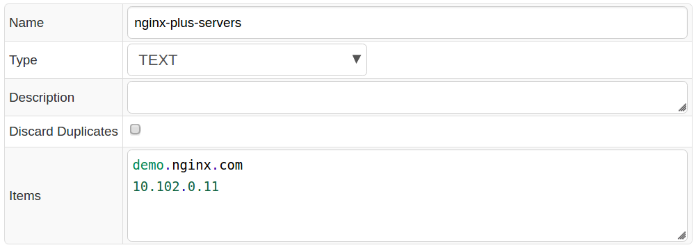
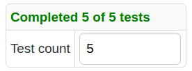

# nginx PLUS Web Server Monitoring

## Overview

This document describes how to collect various metrics from an nginx PLUS web server for long-term retention and monitoring in the Axibase Time Series Database.

You can organize the periodic data collection in several ways:

* Configuring Axibase Collector JSON job to periodically poll server's status page and upload obtained data for parsing in ATSD.
* Using [axibase_nginx_plus_collector](./axibase-nginx-plus-collector) python script along with an OS scheduler. This way is described at [axibase_nginx_plus_collector page](../../../jobs/examples/nginx-plus/axibase-nginx-plus-collector).

The document contains instructions for the first method of configuration.

## Requirements

* NGINX PLUS server with [`ngx_http_status_module`](http://nginx.org/en/docs/http/ngx_http_status_module.html) enabled.
* [Axibase Collector](../../../README.md) for scheduled polling of the NGINX status page.
* [Axibase Time Series Database](https://axibase.com/docs/atsd/installation/) as a centralized data repository.

## Configure a job in Axibase Collector

Axibase Collector polls the nginx PLUS status page every 5 seconds, build network commands, and send commands to ATSD.

Log in to Axibase Collector web interface.

### Create Item List for nginx PLUS servers

* Open the **Collections > Item Lists** page.
* Add a new TEXT [Item List](../../../collections.md) named `nginx-plus-servers` containing DNS names or IP addresses of the monitored nginx PLUS servers, one server per line. Make sure that each server on the list is accessible on the specified protocol and port and exposes the status page on the same path `/status`. If the protocols and ports are different, move the entire url to the list and set Path field equal to the`${ITEM}` placeholder.
* Click **Save**.



### Import a Job

* Import the [`nginx-plus-collector-job.xml`](./configs/nginx-plus-collector-job.xml) job on the **Jobs** page by selecting **Import** from the split button below the table.
* Open the `nginx-plus-statistics` JSON job.
* If the **Storage** drop-down is set to **None**, select the target ATSD server.
* Set **Status** to **Enabled**.
* Click **Save**.

The job consists of several settings blocks, each of which is responsible for processing specific data from the nginx PLUS status page. Each block forms special `series` and `property` commands for ATSD depending on what is being processed by the block. For example, the first settings block is responsible for processing general information about an nginx PLUS Server. This block fetches different metrics: `connection`, `ssl handshakes`, `requests`, `respawned processses` of the server and general properties such as `address`, `nginx_version`, `load_timestamp`, etc.


The result `series` and `property`commands formed by the block must look like this:

```ls
series e:demo.nginx.com d:2016-08-02T10:35:46.608Z m:nginx-plus.connections.accepted=40750818 m:nginx-plus.connections.dropped=0 m:nginx-plus.requests.current=11 m:nginx-plus.ssl.handshakes=45602 m:nginx-plus.connections.idle=34 m:nginx-plus.requests.total=85010375 m:nginx-plus.processes.respawned=0 m:nginx-plus.ssl.session_reuses=7504 m:nginx-plus.connections.active=11 m:nginx-plus.ssl.handshakes_failed=6641
property t:nginx_info e:demo.nginx.com d:2016-08-02T10:35:46.608Z k:address=206.251.255.64 v:nginx_version=1.9.13 v:pid=12121 v:load_timestamp=1469872800422 v:generation=17 v:version=6
```

Other settings blocks in the provided [Collector Job Configuration File](./configs/nginx-plus-collector-job.xml) have the following characteristics:

* **Second** settings block collects information about all peers of upstreams and `stream.upstreams`.
* **Third** settings block collects all information about server zones and upstreams, along with general properties of all caches of the server.
* **Fourth** settings block is responsible for getting all information about `stream.server_zones`.
* **Fifth** settings block collects more detailed data about all the caches of the server.

### Validate Data Availability

* Open the `nginx-plus-status` configuration in the `nginx-plus-statistics` job.
* Click **Test** to verify processing.



* Log in to the ATSD web interface.
* Open the **Metrics** tab and apply the `nginx-plus*` name mask to view nginx metrics received by ATSD.
* Click on **Series** link and check that metrics are present for each server in the **`nginx-plus-servers`** list.


## Viewing Data in ATSD

## Metrics

List of collected [nginx PLUS Server Metrics](./nginx-plus-server-metrics.md).

## Entity Group

* Open the **Settings** menu and select **Entity Groups**, click **Import**, and upload [`nginx_plus_entity_group.xml`](./configs/nginx-plus-entity-group.xml).
* Select the imported `nginx-plus-servers` group.
* Verify that the group contains your nginx servers.

## Portal

* Open the **Portals** menu and select **Configure**, click **Import**, and upload [nginx-plus-portal.xml](./configs/nginx-plus-portal.xml).
* Click the **Assign** link and associate the portal with the entity group created earlier.
* Open **Entity** tabs, find the nginx PLUS servers you would like to see information about, and click the **Portal** icon.


[nginx PLUS Status portal example](http://apps.axibase.com/chartlab/0adf6705)

## Notifications

Monitor key nginx PLUS statistics by creating a rule in ATSD Rule Engine to send an email notification in case of abnormal conditions.

For example, send an email if the average active connections* count over the last 15 minutes on a target nginx PLUS server drops below the specified threshold.

### Setting up Mail Client

* Configure [Mail Client](https://axibase.com/docs/atsd/administration/mail-client.html).

### Import rules

* Download the [Rules](./configs/nginx-plus-rules.xml).
* Open the **Alerts > Rules** page.
* Click **Import** and attach the `nginx-plus-rules.xml` file.
* Open created rules in the **Rule Editor** and change recipient address on the **Email Notifications** tab.
* These rules automatically apply to all nginx PLUS servers monitored by Axibase Collector.

The following rules are provided in the `nginx_plus_rules.xml` file:

| **Rule**                                     |                                      **Description**                        |
|:----------------------------------------:|:------------------------------------------------------------------------|
|`nginx_plus_respawned_proc_increase`        | Raise an alert when an NGINX PLUS server's total number of abnormally terminated and respawned child processes increases.|
| `nginx_plus_fails_high`                    | Raise an alert when an NGINX PLUS server's total number of unsuccessful attempts to communicate with some peer server is high.|
| `nginx_plus_dropped_high`                 | Raise an alert when an NGINX PLUS server dropped sufficient amount of connections. |
| `nginx_plus_downtime_long`                 | Raise an alert indicating NGINX PLUS server's peer is in "unavail" and "unhealthy" states during a specified period of time (default: 15 minutes). |
|`nginx_plus_active_connection_low`          | Raise an alert when an NGINX PLUS server average active connection count is below the specified threshold (default: 10) over the last 15 minutes.|
| `nginx_plus_active_connection_heartbeat`   | Raise an alert when status page statistics are no longer being received by ATSD. Check that the server is reachable and Axibase Collector job is running. |

To create your own rules, refer to [Rule Engine Documentation](https://axibase.com/docs/atsd/rule-engine/).
