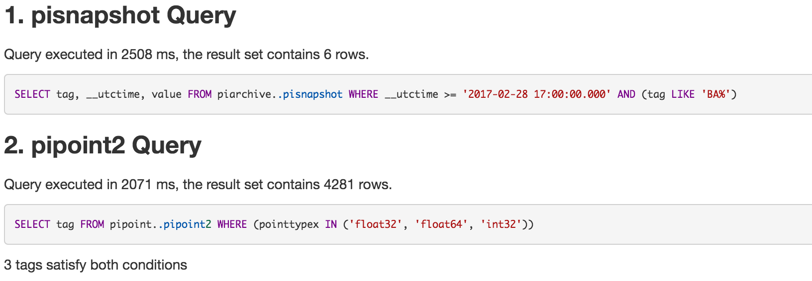
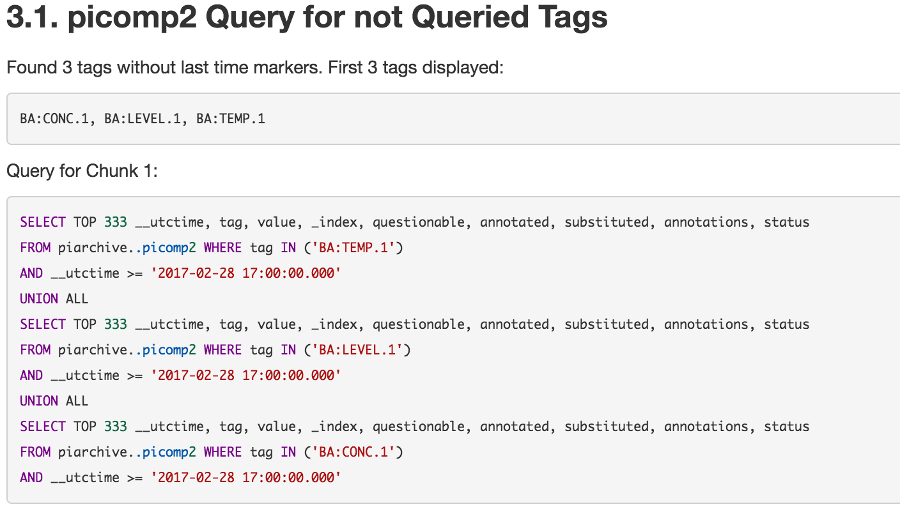
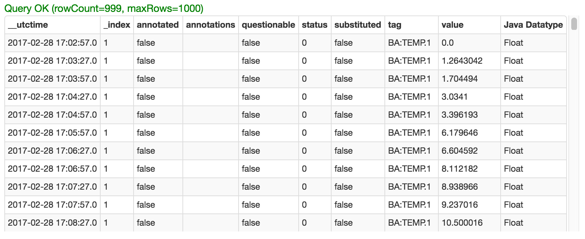
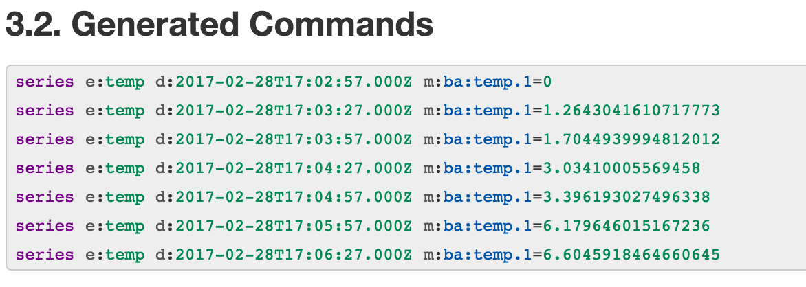

# PI Server

## Overview

This document describes how to export archive data from a [PI Server](http://www.osisoft.com/pi-system/pi-capabilities/pi-server/) into the Axibase Time Series Database as series commands using the Collector PI job.

## Requirements

* PI SQL Data Access Server `1.5+`
* PI JDBC Driver `1.5+`

Install PI JDBC driver and add the driver as a data source in Collector. Follow the steps in [Axibase Pi Documentation](./export-metrics.md#provide-axibase-collector-with-pi-jdbc-driver) to perform this task.

## PI Job Configuration

Select **PI** in the **Jobs** drop-down list. Click **Add Job**. Fill in all the necessary fields.

## PI Task Configuration

Click **Create Configuration**.
Provide tag-to-entity mapping. You can use freemarker expressions in the `Entity` field for string manipulations.
If you want to query only a subset of available tags or get `picomp2` values satisfying the condition, fill in the `WHERE Filter` fields.

When you finish, click **Test** to see the queries executed by the job, returned result set, and generated ATSD network commands. During the test mode the number of queried `picomp2` rows is limited by 1000.

If the option **Use JOIN Clause while Fetching Tag Names** is enabled, only one query is executed:

When configuration is done, save the job and click **Run**.
View execution details by clicking on the **View** link in the **Execution Details** column.

You can see executed queries info by following the **Details** link.

**Tag Statistics** leads to a page with information on every processed PI tag, such as first and last collected measure time, last value, number of collected measures.

## Verify Metrics in ATSD

* Log in to ATSD.
* Open the **Entities** tab and filter entities by name, for example `temp`.

* Follow the link in the **Metrics** column

