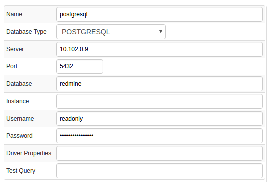

# PostgreSQL

## Overview

This document describes how to collect statistical metrics introduced in [PostgreSQL](http://www.mysql.com/) `9.1+` for long-term retention and monitoring in Axibase Time Series Database.

The process involves enabling a JDBC job in Axibase Collector to poll [statistics views](https://www.postgresql.org/docs/9.1/static/monitoring-stats.html) in the PostgreSQL database and uploading the counters and properties into ATSD for processing.

## Requirements

* PostgreSQL `9.1+`

## Installation Steps

## Create a readonly user for Axibase Collector

* Create a user:

```sh
adduser readonly
```

* Log in as a `postgres` user and open the `psql` console:

```sh
sudo su postgres
psql
```

* Run these commands in the `psql` console:

```sql
CREATE ROLE readonly;
GRANT SELECT ON ALL TABLES IN SCHEMA public TO readonly;
ALTER USER readonly WITH PASSWORD 'readonly';
ALTER USER readonly VALID UNTIL 'infinity';
ALTER ROLE readonly login;
```

* Open the file `/etc/postgresql/${POSTGRES_VERSION}/main/pg_hba.conf`.
* Add the following record to allow remote access from the Axibase Collector server using its IP address:

```txt
host    all             readonly        192.0.2.1           trust
```

* Open the file `/etc/postgresql/${POSTGRES_VERSION}/main/postgresql.conf`.
* Enable the database to accept remote connections by specifying the external IP address:

```sh
listen_addresses = 'localhost,192.0.2.1' # what IP address(es) to listen on;
```

### Import PostgreSQL Job into Axibase Collector

* On **Jobs** page, select **Import** from the split button below the table and upload the [`postgres-jobs.xml`](./postgres-jobs.xml) file.

### Configure PostgreSQL Database Connection

* Open the **Data Sources > Databases** page and select the `postgresql` database.
* Provide connection parameters to the target PostgreSQL database displayed below:



* Execute test query to check the connection:

```SQL
SELECT 1
```

* Query result must be `Query OK`.

### Verify Job Configuration

* Open the **PostgreSQL** job.
* Set **Data Source** to `postgresql`.


* Choose one of the target ATSD instances if your Collector instance is connected to multiple ATSD servers.
* Save the Job.
* Open each configuration, click **Test**, and review the output. See [Data Queries](#data-queries).


### Schedule the Job

* Open the **JDBC Job** page and click **Run** for the **PostgreSQL JDBC** job.
* Ensure that the job status is `COMPLETED` and **Items Read** and **Sent commands** are greater than 0.


* If there are no errors, set the job status to **Enabled** and save.

### Verify Metrics in ATSD

* Log in to ATSD.
* Click the **Metrics** tab and filter metrics by name `postgres.*`.


## Viewing Data in ATSD

### Metrics

* List of collected [PostgreSQL metrics](./metric-list.md)

### Properties

* List of collected [PostgreSQL properties](./properties-list.md)

### Entity Groups

* Open **Settings > Entity Groups**.
* Create a new Entity Group with the split button at the bottom of the page, navigate to the **Expression** tab under **Members**, and enter the following expression:

```javascript
hasMetric('postgres.global_status.uptime')
```

* Save and verify that the group contains PostgreSQL database hosts:


### Portals

* Open the **Portals** menu and select **Configure**. Import a `postgresql` portal from [`portal-postgres.xml`](./portal-postgres.xml).
* Click the **Assign** link and associate the portal with the entity group you created earlier.
* Open **Entities** tabs, find the `postgresql` database by name, and click the **Portal** icon.


[PostgreSQL Live Portal](https://apps.axibase.com/chartlab/070b4941)


## Data Queries

Metrics Queries select most recent statistics as described in the [Data Queries Documentation](./data-queries.md).
