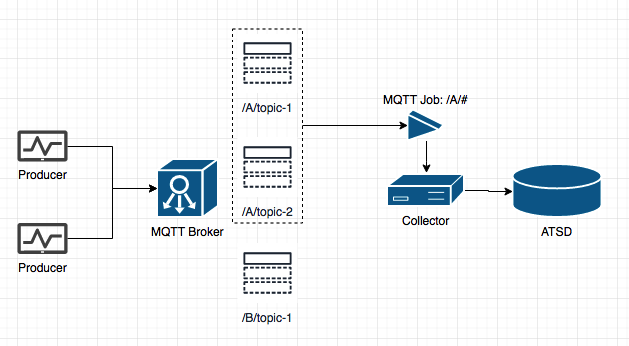
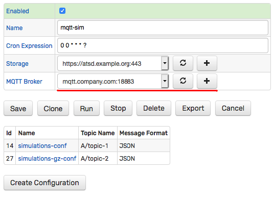
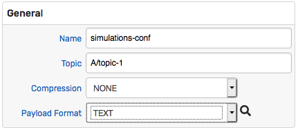
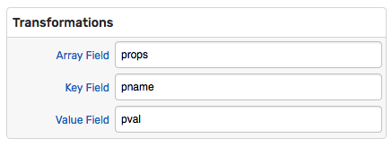

# MQTT Job

## Overview

The MQTT job provides a way to subscribe for messages with an MQTT message broker. The messages are continuously read from one or multiple matching topics in CSV, JSON or plain text formats and stored as series, property, and message [commands](https://axibase.com/docs/atsd/api/network/) in the Axibase Time Series Database.



## Job Settings

The connection to the target MQTT broker is set at the job level and applies to all configurations within the same job. The **MQTT Broker** setting at the job level specifies which MQTT broker to connect to. The list of [brokers](./mqtt-broker.md) can be configured on the **Data Sources > MQTT Brokers** page or by clicking on the plus icon.



## Job Configuration

The job may contain multiple configurations with each configuration representing a separate subscription.

Click **Create Configuration** to create a subscription.

## Topic Filter

The **Topic** field contains the filter expression which can select a specific topic or match multiple topics using `/` as the level delimiter and `#` as the multi-level [wildcard](https://www.ibm.com/support/knowledgecenter/en/SSFKSJ_7.5.0/com.ibm.mq.pla.doc/q005020_.htm).

Examples:

* `A/topic-1` - subscribe to the `A/topic-1` topic.
* `A/#` - subscribe to all topics under the `A` level, for example `A/topic-1` and `A/topic-2`, but not `B/topic-1`.



## Message Format

**Format** | **Description** | **Supported Command Types**
--- | --- | ---
CSV | Multi-line comma-separated text. | Series, property, message.
TEXT | Free-form text. | Series, property, message.
JSON | JSON document | Series.

## Compression

**Format** | **Description**
--- | ---
NONE | Payload message is processed as text, without decompression.
ZIP | Payload message is decompressed with `zip` codec.
GZ | Payload message is decompressed with `gzip` codec.

## CSV Format

If `CSV` format is selected, the message is automatically split into lines and the expression in the **Command Template** field is applied to **each line separately**.

### Variables

The following variables can be included in the command template and passed to functions:

**Name**| **Description**
---|---
`job` | Current job name.
`configuration` | Current configuration Name.
`topic` | Message source topic.
`receiveTime` | Message delivery in Unix milliseconds.
`host` | Broker host.
`port` | Broker port.
`text` | Message payload, the entire text consisting of all lines.
`line` | Current line in the CSV document.

### Methods

**Name**| **Description**
---|---
`cell(int n)` | `n` - column index, starts with `1` for the first column.<br>Returns the value of `n-th` cell in the current line by index.<br>Returns an empty string if the index is out of range.

### Configuration Example

Sample message payload, consisting of two lines without a header:

```txt
br-1116,2019-04-16T11:16:59.189Z,,temperature,90.44,pressure,4.0
br-1489,2019-04-16T11:16:59.148Z,,temperature,30.31,pressure,4.6
```

Command template, applied to each line:

```ls
series d:${cell(2)} e:${cell(1)} t:topic=${topic} m:${cell(4)}=${cell(5)} m:${cell(6)}=${cell(7)}
```

Series commands produced by applying the template to each line:

```ls
series d:2019-04-16T11:16:59.189Z e:br-1116 t:topic=/test/bioreactor m:temperature=90.44 m:pressure=4.0
series d:2019-04-16T11:16:59.148Z e:br-1489 t:topic=/test/bioreactor m:temperature=30.31 m:pressure=4.6
```


Example:


## JSON Format

If `JSON` format is selected, the payload is parsed as a JSON document and the ATSD `series` command [fields](https://axibase.com/docs/atsd/api/network/series.html) are extracted from the named fields in the JSON document.

### Arrays

If the message payload is an array, each element in the array is processed as a separate JSON document.

```json
[
    { -- document-1 > command-1 },
    { -- document-2 > command-2 }
]
```

### Key-Value Maps

If the JSON document contains an object with paired names and values, use the **Transformation** section to extract the pairs into series tags.

```json
"props": [
      { "pname": "Site", "pval": "NUR" },
      { "pname": "Building", "pval": "A-1" }
]
```



### Entity Fields

**Name** | **Description**
---| ---
Field | Entity name, specified literally or extracted from the specific field in the document.
Default Value | Default value applied if the entity name cannot be extracted from the payload message.

The **Default Value** can include placeholders with the following variables, for example `${host}`.

**Name**| **Description**
---|---
`job` | Current job name.
`configuration` | Configuration name.
`topic` | Topic name.
`host` | Broker host.
`port` | Broker port.

### Time Fields

**Name** | **Description**
---| ---
Field   | Name of the JSON field containing the event date.
Format  | Date pattern applied when parsing the date.
Zone    | Timezone applied to the parsed date if the format lacks the timezone information, otherwise the Collector time zone is in effect.

### Series Fields

**Name** | **Description**
--- | ---
Metric Prefix | Text added to the metric name.
Included Fields | By default, all **numeric** fields from nested objects are included in the series command as metrics. To override, specify the list of included fields by name, separated by comma.
Excluded Fields | List of field names excluded from the command. Applies when **Included Fields** is empty.
Annotation Fields | List of field names whose values are saved as text annotation.
Name & Value Fields |Name of the field containing the metric name and metric value.


## TEXT Format

If `TEXT` format is selected, enter an expression in the **Command Template** field to convert message text to a valid ATSD [command](https://axibase.com/docs/atsd/api/network/).

All variables for `CSV` mode are available in `TEXT` mode as well except the `line` variable.


