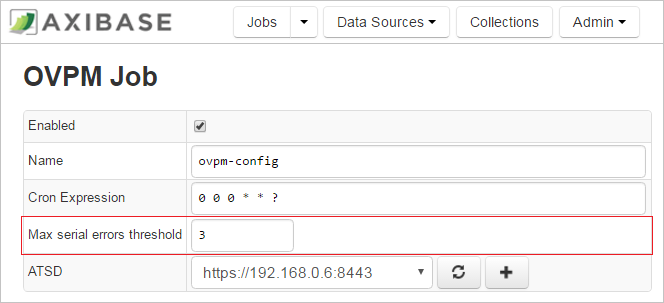
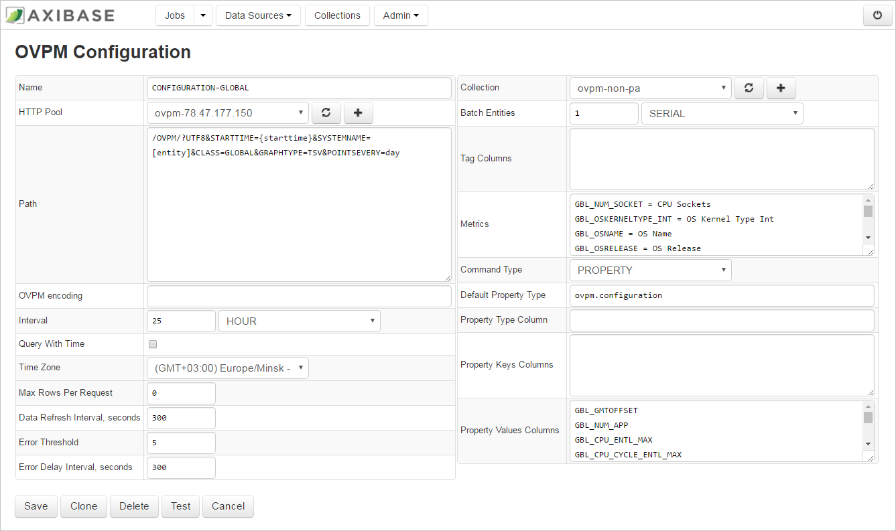

# OVPM Job

OVPM protocol is used to retrieve data from the HP OpenView Performance Manager.

## Job Settings

In comparison to the [Generic job](../job-generic.md) settings, OVPM job has an additional job-specific parameter.  

**Max. serial errors threshold** - defines the maximum amount of consecutive errors after which no more queries are sent by the database.

## OVPM Configuration

To configure an OVPM job, click Create OVPM configuration.
Use the table below to set configuration parameters.

| Field        | Description           |
|:------------- |:--------------|
|  Name    | Configuration name.   |
| HTTP Pool  | Data source. |
| Path  | Relative path to OVPM CSV endpoint. |
| OVPM encoding | Character set that is used to parse the resulting data. |
| Interval  | Data interval downloaded. |
| Query With Time  | When executing the job, the server is set to the maximum time of the previous data. |
| Time Zone | Timezone in which the data is collected. |
| Max Rows Per Request  | Maximum amount of rows retrieved.  |
| Data Refresh Interval, seconds | OVPM sampling interval. |
| Error Threshold  | Amount of error requests after which no more queries are sent. |
| Error Delay Interval, seconds  | Interval during which the current entity is excluded from queries, in the case that there are previous errors.  |
| Entity Group | List of hosts, entity groups created in Axibase Collector. |
| Batch Entities  | Defines the number of entities grouped in one query. |
| Tag Columns | Columns containing tags. |
|  Metrics | List of metrics that collected. |
| Put Type  | Type of data: metric, property, or both. |
| Default Property Type  | Default property type. |
| Property Type Column  | Column containing the property types. |
| Property Keys Columns  | Columns containing the property keys. |
| Property Values Columns  | Columns containing the property values. |

