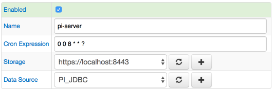

# PI Job

## Overview

The PI Server is the real-time data storage and distribution engine that provides a comprehensive real-time and historical view into operations

Axibase Collector can be configured to extract data from the PI Server via JDBC, transform PI tags into ATSD metrics, and upload metrics to ATSD for long-term retention and analytics.

## Preconditions

Before starting to configure the PI job, a machine must have the PI JDBC driver installed and stored in the Collector classpath. To perform this task, see [Axibase Collector Documentation](examples/pi/export-metrics.md#provide-axibase-collector-with-pi-jdbc-driver).

## Job Settings

Just like the general [JDBC job](jdbc.md), PI job has a **Data Source** field. This allows a user to select the configured PI JDBC data source.

### PI Configuration

To configure a PI job, click **Create Configuration**.
Use the table below to set configuration parameters.

| FIELD              | DESCRIPTION  |
| :----------------- |:-------------|
| Entity | The expression to retrieve entity name from PI tag name. Supported placeholders: - `${TAG}` = current processed PI tag - [`${LOOKUP()}`](placeholders.md#lookup-function) = function to retrieve a value for key from an Item List |
| Default Entity | Default entity applied if Entity Expression is not specified or entity is not found in the **Item List**. |
| Default Tags | List of `name=value` tag pairs, one per line, stored as series tags. Tag value can refer to the `${TAG}` placeholder. |
| `pisnapshot WHERE` Filter | An expression included in the `WHERE` clause when querying the `pisnapshot` table. The expression must return a boolean value. |
| `picomp2 WHERE` Filter | An expression included in the `WHERE` clause when querying the `picomp2` table. The expression must return a boolean value. |
| `pipoint2 WHERE` Filter | An expression included in the `WHERE` clause when querying the `picomp2` table. The expression must return a boolean value. |
| Collecting Start Time | [Calendar expression](https://axibase.com/docs/atsd/shared/calendar.html) defining the beginning of the data collection interval, for example: `previous_week`. |
| Use `JOIN` Clause while Fetching Tag Names | If disabled, results of `pipoint2` and `pisnapshot` tables are merged on the client side (in Collector). If enabled, Collector executes one query with `JOIN` clause to filter tags. |
| Ignore Unresolved Entity | If enabled, skip tags for which no valid entity can be retrieved. If the entity is invalid and this case is not ignored, the job fails with an error. |
| Collect QSA Fields | If enabled, collect non-default values of questionable, substituted, annotated, annotations columns. |
| Collect Status Fields | If enabled, collect non-default (non-zero) status. |
| Store QSA and Status as Annotation | If enabled, QSA and status columns are serialized into text (annotation) field like `questionable=true;substituted=true;annotated=true;status=-253`. If disabled, QSA and status columns are stored as series tags by Collector. |
| Number of Tags in One `picomp2` Query | Maximum number of tags included in one query. |
| Max Rows in `picomp2` Result Set | Maximum number of rows per query |
| Query Timeout, seconds | Query timeout in seconds |

### Configuration Example

The image below shows an example PI configuration.

### Examples

[PI Job](examples/pi/export-archive-data.md)