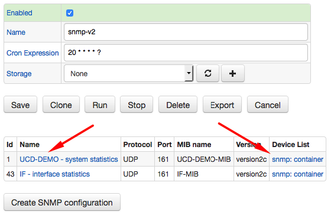
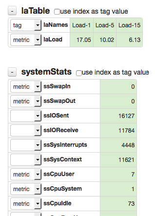

# SNMP Job

The SNMP job collects metrics from IP-addressable devices over the SNMP (Simple Network Management Protocol) protocol. It allows monitoring system availability and performance without installing a custom agent on the target system. The statistics are exposed by a SNMP daemon available by default on network devices and as a package for Linux, Windows, and HP-UX operating systems.

## Prerequisites

* Install `snmp` package in the Collector server.

```bash
apt-get install snmp
```

```bash
yum -y install net-snmp net-snmp-utils
```

* Verify that `snmptranslate -h` utility is installed.

```txt
USAGE: snmptranslate [OPTIONS] OID [OID]...
Version:  5.7.2
...
```

* Import base [MIB files](#base-mib-files) into the Collector prior to creating SNMP jobs.

## Job Settings

The SNMP job allows creating multiple configurations to query objects in different [MIB files](#mib-files). The configurations are executed sequentially, while SNMP `GETBULK` operations to remote devices in each configuration are executed in parallel.

Each configuration retrieves pre-defined object values, identified by OID (Object Identifier), from hostnames or IP addresses in the **Device List**. Metrics collected from the same device are sent into ATSD under an entity name based on the device hostname or IP address as specified in the **Device List**.



## Configuration Settings

The settings specify the list of devices to query as well as connection properties.

### Query Settings

| Field          | Description  |
| :------------- |:-------------|
| Device List | List of hostnames or IP addresses to query. |
| Metric Prefix | Prefix added to metric names sent into ATSD. |
| MIB Name | MIB file containing object definitions. |
| Metric OIDs | Object names containing numeric metric values. |
| Series Tag OIDs | Object names containing series tags. |

To populate the list of collected metric objects, click **Configure** button to view the editor.

Enter a hostname or IP address for one of the target systems and click **Load All Values**. Choose which objects to collect. If the object has an additional dimension such as interface or disk name, classify such OID as `tag`.



### Connection Settings

| Field          | Description  |
| :------------- |:-------------|
| Transport | TCP or UDP protocol used for connecting to the devices. |
| Port | TCP or UDP port. |
| Version | SNMP protocol version. |
| Community |  SNMP community name, such as `public`.|
| Timeout, seconds | Number of seconds after which the Collector interrupts the query. `0` or `-1` is unlimited. |
| Retries | Number of connection retries in case of network failure. |
| Maximum Repetitions | Maximum number of iterations over the repeating variables. |
| Non Repeaters | Number of supplied variables that must not be iterated over. |

Supported SNMP protocol versions:

* SNMP `v2c`
* SNMP `v3`

### Security Settings

The following settings apply to SNMP protocol `v3`.

| Field          | Description  |
| :------------- |:-------------|
| Authentication Protocol | Encryption protocol for authentication.<br>Allowed values: `MD5`, `SHA`. |
| Security Name | Username. |
| Authentication Pass Phrase | Password. |
| Privacy Pass Phrase| Pass phrase for data transmission. |
| Privacy Protocol | Data encryption protocol.<br>Allowed values: `DES`, `TRIPLE_DES`, `AES128`, `AES192`, `AES256`. |
| Security Level | Allowed values:<br>`NO_AUTH_NO_PRIV`: no authentication, no encryption. <br> `AUTH_NO_PRIV`: authentication, no encryption. <br> `AUTH_PRIV`: authentication and encryption. |

## Testing Connections

Network connectivity between the Collector and a remote system is required.

To check that the SNMP daemon on the target device is reachable, open the SNMP configuration page.

Select a MIB file in the drop-down list.

Fill out connection properties and click **Configure**. The configuration settings are saved automatically, when the configuration editor is launched.

Enter the target hostname or IP address and click **Load All Values**.

## Configuration Example

SNMP configuration example:


Click **Test** to view sample series commands for the given configuration.

```ls
series e:192.0.2.1 d:2018-06-27T11:14:56.481Z m:snmp.laLoad=1.56 t:laNames=Load-1
series e:192.0.2.1 d:2018-06-27T11:14:56.481Z m:snmp.laLoad=2.14 t:laNames=Load-15
series e:192.0.2.1 d:2018-06-27T11:14:56.481Z m:snmp.laLoad=1.97 t:laNames=Load-5
series e:192.0.2.1 d:2018-06-27T11:14:56.481Z m:snmp.memShared=494356
series e:192.0.2.1 d:2018-06-27T11:14:56.481Z m:snmp.memBuffer=403904
series e:192.0.2.1 d:2018-06-27T11:14:56.481Z m:snmp.memTotalReal=65124968
series e:192.0.2.1 d:2018-06-27T11:14:56.481Z m:snmp.memAvailReal=16156972
series e:192.0.2.1 d:2018-06-27T11:14:56.481Z m:snmp.memCached=25270224
series e:192.0.2.1 d:2018-06-27T11:14:56.481Z m:snmp.memTotalFree=49637572
series e:192.0.2.1 d:2018-06-27T11:14:56.481Z m:snmp.memAvailSwap=33480600
series e:192.0.2.1 d:2018-06-27T11:14:56.481Z m:snmp.memTotalSwap=33537916
```

## MIB Files

The SNMP daemon running on the remote system publishes available configuration and performance objects using OIDs (object identifiers).
The OIDs are defined in Management Information Base (MIB) files and contain information such as object name, type, data type etc.

```txt
laLoad .1.3.6.1.4.1.2021.10.1.3

enterprises.ucdavis.laTable.laEntry.laLoad
laLoad OBJECT-TYPE
  -- FROM UCD-SNMP-MIB
  -- TEXTUAL CONVENTION DisplayString
  SYNTAX  OCTET STRING (0..255)
  DISPLAY-HINT  "255a"
  MAX-ACCESS  read-only
  STATUS  current
  DESCRIPTION "The 1,5 and 15 minute load averages (one per row)."
::= { iso(1) org(3) dod(6) internet(1) private(4) enterprises(1) ucdavis(2021) laTable(10) laEntry(1) 3 }
```

The Collector needs access to MIB files to translate OIDs received from the remote systems into object names used in ATSD the metric and series tag names.

```txt
1.3.6.1.4.1.2021.10.1.3 --> laLoad
```

```ls
series e:192.0.2.1 d:2018-06-27T10:09:19.649Z t:laNames=Load-1 m:snmp.laLoad=2.79
```

The SNMP job supports built-in and custom MIB files.


## SNMP MIB Import

Load MIB files into the Collector instance on the **Admin > SNMP MIBs** page.

Perform this task initially, as part of post-installation configuration, as well as when you enable monitoring for a new class of remote systems with custom MIB files.

Open **Admin > SNMP MIBs > Upload MIB** page.

Attach a MIB file and click **Upload**.


The MIB file is validated and translated using the [`snmptranslate`](http://net-snmp.sourceforge.net/tutorial/tutorial-5/commands/snmptranslate.html) utility installed on the underlying Linux operating system. A translated list of OIDs is loaded into the Collector database.

### MIB Tree

MIB format is hierarchical and allows for inheriting definitions from parent MIBs. As a result, you must import parent MIBs first.

```txt
IF-MIB DEFINITIONS ::= BEGIN

IMPORTS
    MODULE-IDENTITY, OBJECT-TYPE, Counter32, Gauge32, Counter64,
    Integer32, TimeTicks, mib-2,
    NOTIFICATION-TYPE                        FROM SNMPv2-SMI
    TEXTUAL-CONVENTION, DisplayString,
    PhysAddress, TruthValue, RowStatus,
    TimeStamp, AutonomousType, TestAndIncr   FROM SNMPv2-TC
    MODULE-COMPLIANCE, OBJECT-GROUP,
    NOTIFICATION-GROUP                       FROM SNMPv2-CONF
    snmpTraps                                FROM SNMPv2-MIB
    IANAifType                               FROM IANAifType-MIB;
```

When you import the MIB file the Collector searches for any parent files, specified in the `IMPORTS` section, among the previously loaded MIB files as well as MIB files stored on the underlying operating system.

System MIB directory location:

* On Linux, the MIB files are stored in the `/usr/share/snmp` directory.
* On HP-UX, the MIB files are stored in the `/var/opt/OV/share/snmp_mibs` [directory](http://nixdoc.net/man-pages/HP-UX/snmpdm.1m.html).

### Base MIB Files

The following table contains links to MIB files for monitoring operating system performance metrics.
Upload the MIB files into your Collector instance in the order specified in the **Priority** column.

| Priority | MIB  | Description  | Dependencies |
|:---|:---|:---|:---|
| 1 | [`SNMPv2-SMI.txt`](./resources/SNMPv2-SMI.txt) | - | - |
| 2 | [`SNMPv2-TC.txt`](./resources/SNMPv2-TC.txt) | Represents textual information taken from the NVT ASCII character set | [`SNMPv2-SMI.txt`](./resources/SNMPv2-SMI.txt) |
| 3 | [`SNMPv2-MIB.txt`](./resources/SNMPv2-MIB.txt) | The MIB module for SNMP entities | [`SNMPv2-TC.txt`](./resources/SNMPv2-SMI.txt) |
| 4 | [`UCD-SNMP-MIB`](./resources/UCD-SNMP-MIB.txt) | System load average, CPU utilization, memory configuration and usage, disk used. | [`SNMPv2-MIB.txt`](./resources/SNMPv2-MIB.txt) |
| 5 | [`IF-MIB`](./resources/IF-MIB.txt) | Network interface counters | [`SNMPv2-MIB.txt`](./resources/SNMPv2-MIB.txt) |

## Troubleshooting

### Connectivity

Test that the target server is accessible using `snmpwalk` utility.

```bash
snmpwalk -v2c -c public udp:192.0.2.1:161
```

```txt
iso.3.6.1.2.1.1.1.0 = STRING: "Linux NURSWGVML007 4.4.0-127-generic #153-Ubuntu SMP Sat May 19 10:58:46 UTC 2018 x86_64"
iso.3.6.1.2.1.1.2.0 = OID: iso.3.6.1.4.1.8072.3.2.10
iso.3.6.1.2.1.1.3.0 = Timeticks: (15651) 0:02:36.51
iso.3.6.1.2.1.1.4.0 = STRING: "john.doe@example.org>"
iso.3.6.1.2.1.1.5.0 = STRING: "192.0.2.1"
...
```

### System View Restriction

On some systems, access to OIDs other than those containing basic information is _disabled_ in by the SNMP daemon.

In case of `Bad value(endOfMibView)` error, modify the SNMP daemon configuration on the target server.


The error is displayed as `end of the MIB tree` at the end of the the `snmpwalk` output.

```txt
...
iso.3.6.1.2.1.25.1.7.0 = No more variables left in this MIB View (It is past the end of the MIB tree)
```

Open the `/etc/snmp/snmpd.conf` file.

#### Ubuntu/Debian

Remove `-V systemonly` restriction from the `rocommunity` setting.

```txt
# rocommunity public default -V systemonly
rocommunity public default
```

Restart the SNMP daemon.

```bash
service snmpd restart
```

#### RHEL/Centos

```txt
#       group          context sec.model sec.level prefix read   write  notif
access  notConfigGroup ""      any       noauth    exact  systemview none none
```

Create a new view named `all` containing all OIDs.

```txt
#       name           incl/excl     subtree         mask(optional)
view    systemview    included   .1.3.6.1.2.1.1
view    systemview    included   .1.3.6.1.2.1.25.1.1
view    all           included   .1
```

Grant the `public` community read-only permissions to the `all` view.

```txt
#       group          context sec.model sec.level prefix read   write  notif
access  notConfigGroup ""      any       noauth    exact  all none none
```

Restart the SNMP daemon to apply the changes.

### Unknown Objects

To check that the remote system publishes operating system OIDs in the `UCD-SNMP-MIB` MIB, execute the `snmpwalk` command with the OID filter set to `1.3.6.1.4.1.2021` (`iso(1) org(3) dod(6) internet(1) private(4) enterprises(1) ucdavis(2021)`).

```bash
snmpwalk -v2c -c public udp:192.0.2.1:161 1.3.6.1.4.1.2021
```

The expected output contains a list of nested OIDs.

```txt
iso.3.6.1.4.1.2021.2.1.1.1 = INTEGER: 1
iso.3.6.1.4.1.2021.2.1.1.2 = INTEGER: 2
iso.3.6.1.4.1.2021.2.1.1.3 = INTEGER: 3
iso.3.6.1.4.1.2021.2.1.2.1 = STRING: "mountd"
iso.3.6.1.4.1.2021.2.1.2.2 = STRING: "ntalkd"
iso.3.6.1.4.1.2021.2.1.2.3 = STRING: "sendmail"
iso.3.6.1.4.1.2021.2.1.3.1 = INTEGER: 1
iso.3.6.1.4.1.2021.2.1.3.2 = INTEGER: 0
iso.3.6.1.4.1.2021.2.1.3.3 = INTEGER: 1
iso.3.6.1.4.1.2021.2.1.4.1 = INTEGER: 0
iso.3.6.1.4.1.2021.2.1.4.2 = INTEGER: 4
iso.3.6.1.4.1.2021.2.1.4.3 = INTEGER: 10
iso.3.6.1.4.1.2021.2.1.5.1 = INTEGER: 0
iso.3.6.1.4.1.2021.2.1.5.2 = INTEGER: 0
...
```
