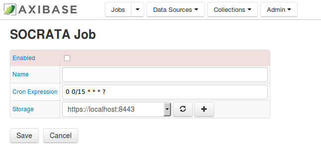
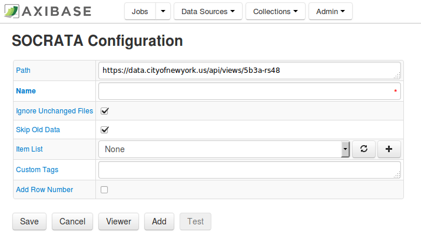
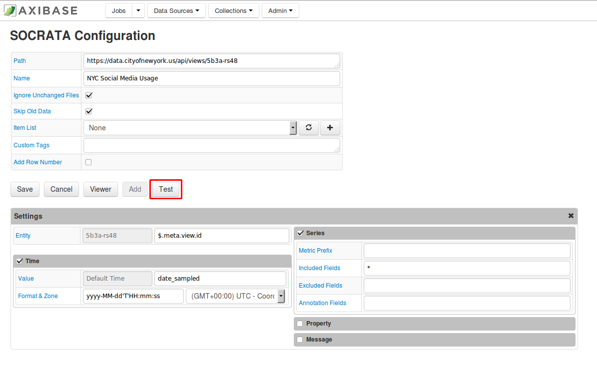

# Socrata Job Tutorial

This tutorial walks through setting up a Socrata job in Collector for a `data.gov` dataset on [New York City Social Media Usage](https://catalog.data.gov/dataset/nyc-social-media-usage-555a2).
The JSON file (1.1 MB) can be found on the [City of New York website](https://data.cityofnewyork.us/api/views/5b3a-rs48/rows.json?accessType=DOWNLOAD).

1. Log in to Collector.

   

2. Click on the **Jobs** tab in Collector.

   

3. Click **Add Job**.

   

4. To select the type of job you would like to add, you may complete either of the following steps.

   * Before completing the previous step, filter by desired job type (Socrata) in the **Jobs** tab. After clicking **Add Job**, the desired job type is specified.

   

   * Click **Add Job** (step 3). On the following page, select your specified job type.

   

5. As shown in the image below, there are four fields to specify: **Enabled**, **Name**, **Cron Expression**, and **Storage**.

   

   * **Enabled**: job status. You may enable the job, and schedule the job for data collection with the period specified in the Cron Expression, by clicking the check box. To
      have the job disabled, do not click the check box. Leave unchecked for this tutorial.
   * **Name**: job name. Enter in a relevant name for your new Socrata job. For this tutorial, use the name `NYC-Social-Media-Usage`.
   * **Cron Expression**: job execution time period. Cron fields are specified in the following order: second, minute, hour, day-of-month, month, and day-of-week. You can randomize time of execution by putting `R` onto time placeholders. Click
      on field to see time periods in human-readable formats, as shown in the image below.
   * **Storage**: database for storing data collected by this job.

   

6. After specifying each of these fields, hit **Save**.
7. Click **Create Configuration**.

   

8. Copy the short URL (without `rows.json?accessType=DOWNLOAD` selected) from your JSON file and paste the URL into the `Path` line. User does not need to fill in the **Name** field, as
   the field is automatically filled in from the previous page. For more information on the remaining fields in this screenshot, see [Job Configuration Documentation](../jobs/socrata.md#job-configuration).

   

9. Press **Add** to create a pre-configured settings section.
10. Press **Test**. To view descriptions of each of the fields shown below, see [Job Configuration Documentation](../jobs/socrata.md#job-configuration).

    

11. After clicking **Test**, you should get the following output: Collector downloads a part of the JSON file (file limitation 1 MB) and generates commands based on
    the dataset configuration (series, property, message, metric, and entity tags). These commands are only for text purposes, and are not yet saved in ATSD.

    You may save this configuration by clicking **Save**, shown in the image from step 10.

    

12. Navigate back to the Socrata job (the figure shown in step 7). Press **Run**. This sends generated commands to ATSD, which enables user to begin working with this dataset.
    After hitting **Run**, you are redirected to this page by the database. Hit **Refresh** after a couple of seconds. If the database successfully completed the job, you see something like the images below.

    

    

13. Navigate to your local ATSD instance and log in. Open the **Entities** tab to verify that metrics from the dataset are present in ATSD. You can search by your `dataset id`, which
    is assigned by the database from the original JSON file, in this case the id is `5b3a-rs48`. You can see that metrics were successfully sent from Collector to ATSD and begin analyzing this dataset.

    
