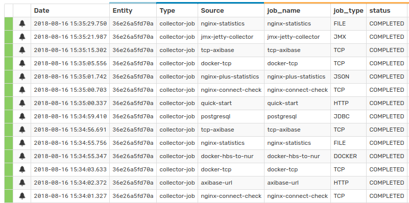
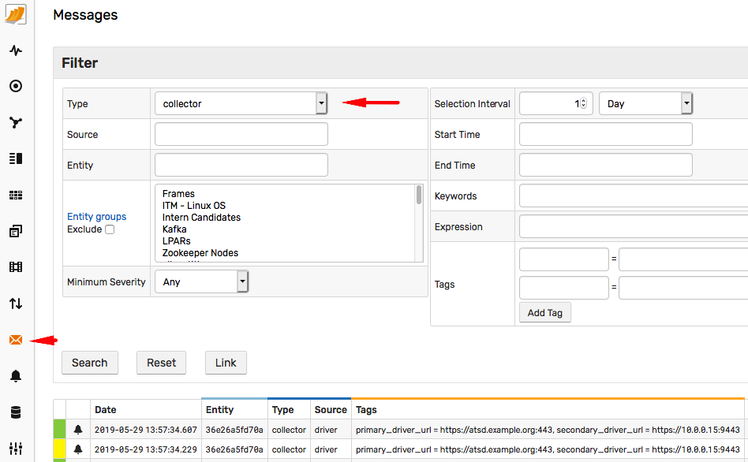
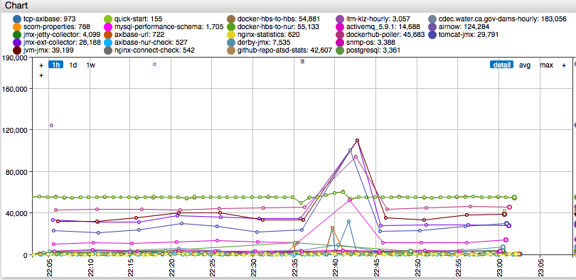
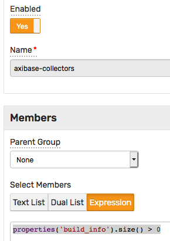
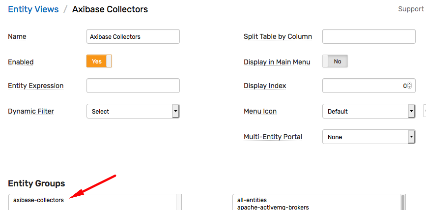
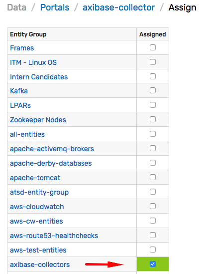
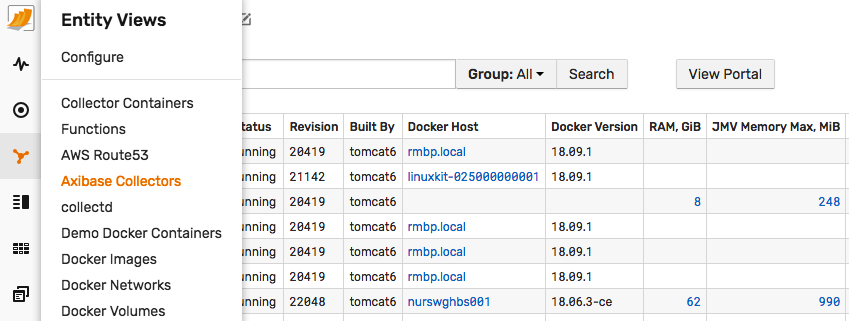
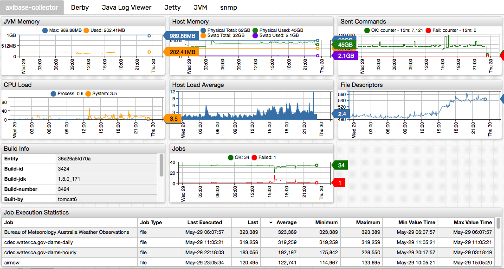

# Monitoring

## Overview

Collector is instrumented to report job status messages and key performance counters to the primary ATSD over the same storage driver connection as used for the collected data itself.

## Job Status Messages

The job status message is produced after the job is completed. The message contains the following fields.

Field | Description
---|---
Type | `collector-job`
Source | `job_name`
Severity | - `NORMAL` if successful<br/>- `MAJOR` on `PARTIAL_FAIL`<br/>- `CRITICAL` in case of `ERROR`
Entity | Collector hostname.
Tag `job_name` | Job name.
Tag `status` | `COMPLETED`, `PARTIAL_FAIL`, `FAIL`
Tag `job_type` | Job type, such as `FILE`, `JDBC`, `JSON`, etc.
Message | Job result  summary or error details if the job  encountered an error.

Some job types provide an extended set of tags, for example [`error type`](./jobs/completion-messages.md) reported by the [`FILE`](./jobs/file.md) job.

Job status messages can be viewed on the **Message Search** page under `collector-job` type.



## Driver Status Messages

Connection error and failover messages are reported under the `collector` type.



## Performance Counters

The key metrics include information about job execution times, job counts, and key JVM metrics.


The following example demonstrates a portal configuration that allows viewing job execution times.

```ls
[widget]
  type = chart
  timespan = 1 hour
  label-format = tags.job

  [series]
      entity = 36e26a5fd70a
      metric = collector.job-exec-time
      [tags]
        job = *
```



## Monitoring Multiple Collectors

To view the health and performance of multiple collector instances, execute the following steps.

### Create Entity Group

Open **Settings > Entity Groups** and create a new entity group called `axibase-collectors`. Set the group **Expression** to `properties('build_info').size() > 0`.



### Create Entity View

Open the **Entity Views > Configure** page and import the following **Axibase Collectors** view from the [`entity-view-collectors.xml`](./files/entity-view-collectors.xml)

Check that the view is mapped to the `axibase-collectors` group.



### Create Portal

Open the **Portals > Configure** page and import the following **axibase-collector** portal from the [`portal-axibase-collector.xml`](./files/portal-axibase-collector.xml)

Check that the portal is assigned to the `axibase-collectors` group.



### Verify Configuration

Open the **Entity Views > Axibase Collectors** page and verify that collectors are listed in the summary table.



Click the chart icon on the left to view the assigned portal.


